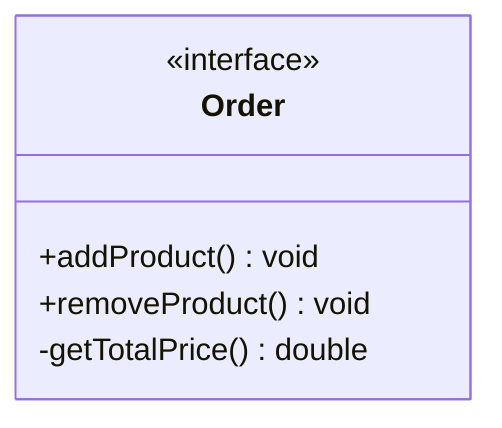
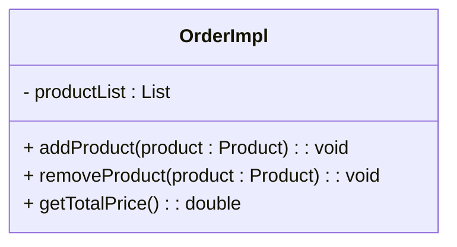
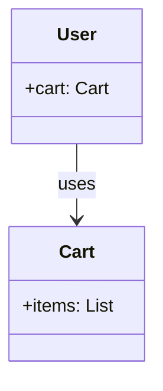
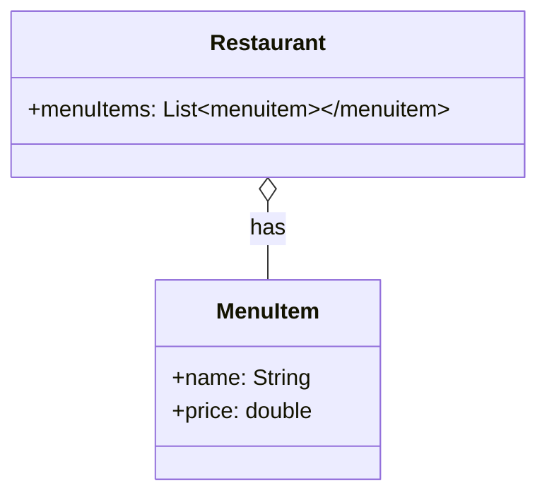
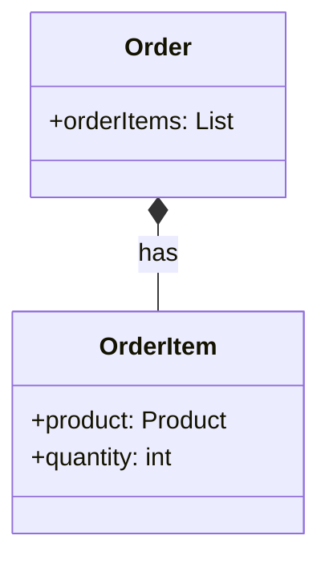
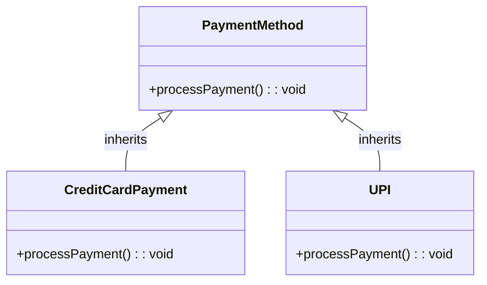
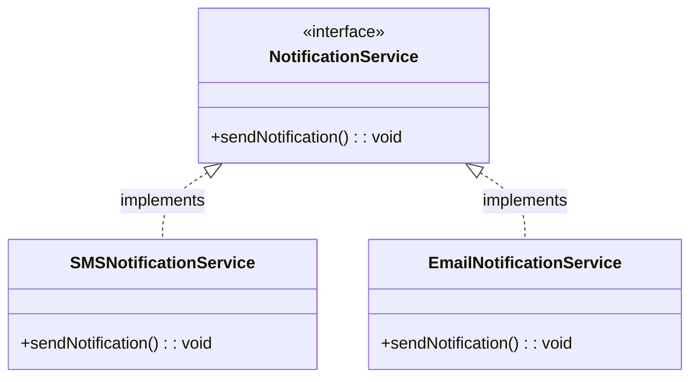
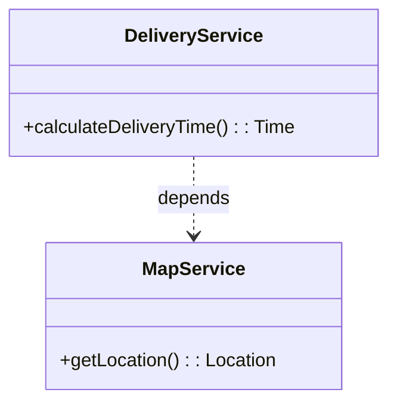

# Class Diagrams

A UML Class Diagram provides a high-level overview of the system architecture. It captures the system's classes, interfaces, enumerations, their attributes and operations (methods), and the relationships among them. It is instrumental in both forward and reverse engineering processes and is widely used in modeling object-oriented systems.

Looking at a class diagram, you must quickly be able to understand the system's structure and how different components interact with each other. This is particularly useful for new team members or stakeholders who need to get up to speed with the system's design regardless of understanding the underlying code.


## UML Class Notations


### Class Representation

In the **Compartment** of a class diagram, a class is represented as a rectangle divided into three sections:

- **TOP - Class Name**: The name of the class is typically centered at the top of the rectangle representing the class.
- **MIDDLE - Attributes**: The attributes (or properties) of the class are listed in the middle section. 
- **BOTTOM - Methods**: The methods (or operations) of the class are listed in the bottom section. 

A **compartment** is a visual representation of a class's structure, and it helps to organize the information about the class in a clear and concise manner.

### Visibility Markers

- **Public :** Represented by a plus sign (+). 
- **Private :** Represented by a minus sign (-).
- **Protected :** Represented by a hash sign (#).
- **Package :** Represented by a tilde sign (~).


## Syntax

- **Attributes**: `visibility name : type = defaultValue` (if applicable)

    Example: `+ price : double = 0.0` represents `public double price = 0.0;`.

<br/>

- **Methods**: `visibility name(parameterList) : returnType`

    Example: `+ getPrice() : double` represents `public double getPrice();`.

<br/>

- **Interface**: `<<interface>> interfaceName`
    
    Example: `<<interface>> Payment` represents `interface Payment`.

<br/>

- **Abstract Class**: `<<abstract>> className` (the class name is typically italicized)
    
    Example: `<<abstract>> Vehicle` represents `abstract class Vehicle`.

<br/>

- **Enumeration**: `<<enumeration>> enumName`
    
    Example:

    ```uml
    <<enumeration>> Color
    - RED
    - GREEN
    - BLUE
    ```

    This represents `enum Color { RED, GREEN, BLUE }`.


<br/>

---


## Perspective of Class Diagrams

### 1. **Coneptual Perspective**:

- Represents the concepts of the domain.
- Its purpose is to provide a high-level view of the system, focusing on the main concepts and their relationships.

- The stakeholders of such perspective are typically business analysts, domain experts, and project managers who do not need to know the technical details of the system rather a high-level understanding of the system's structure and behavior.

- Example: `Customer -> places -> Order -> contains -> Product`


### 2. **Specification Perspective**:

- Focus is on the interfaces of the ADTs (Abstract Data Types)  of the system.
- Its purpose is to define the structure and behavior of the system's classes, focusing on responsibilities, roles, and collaborations without specifying code-level details.

- The stakeholders of such perspective are typically software architects, designers, and developers who need to understand the system's design and how different components interact with each other.

- Example: 




### 3. **Implementation Perspective**:

- Describes how classes will implement their interfaces.

- Its purpose is to present a concrete, code-level view of the system. This perspective includes complete class definitions, access modifiers, attributes with types and default values, and full method signatures.

- The stakeholders of such perspective are typically developers and testers who need to understand the system's implementation details and how to work with the codebase.

- Example:



---

<br/>


## Relationships between Classes

### 1. **Association**:

- Represented by `--->` (arrow)

- This relationship represents a `USES-A` relationship between two classes where ones class uses or interacts with another class. 

- Example: 


### 2. **Aggregation**:

- Represented by `o--->` (hollow diamond arrow)

- This relationship represents a `HAS-A` relationship between two classes where one class contains another class but the contained class can exist independently without the container class.

- Example: 


There might arise the question that Association and Aggregation are kinda similar but the core difference lies in usage, in aggregation the `MenuItem` can exist without the `Restaurant` (Same Menu Items can be used in different restaurants) but in association the `Cart` cannot exist without the `User` (Each User has their own Cart).


### 3. **Composition**:

- Lifecycle matters.

- Represented by `*--->` (filled diamond arrow)

- This relationship represents a `strong HAS-A` relationship between two classes where the parts cannot exist without the whole. If the whole is destroyed, the parts are also destroyed.

- Example: 
If order is deleted, the order items are also deleted.



### 4. **Inheritance**:

- Represented by `--|>` (arrow with a filledtriangle)

- This relationship represents an `IS-A` relationship between two classes where one class inherits from another class. The subclass inherits the attributes and methods of the superclass.

- Example: 


### 5. **Realization(Implementation)**:

- Represented by `..|>` (dotted arrow with a triangle)

- This relationship represents a `realizes` relationship between an interface and a class where the class implements the interface. The class provides concrete implementations for the methods defined in the interface.

- Example: 



### 6. **Dependency**:

- Represented by `..>` (dotted lines and unfilled arrow)

- This relationship represents a `USES` relationship where a change in one class may affect another class. It indicates that one class depends on another class for its functionality.

- Example: 


