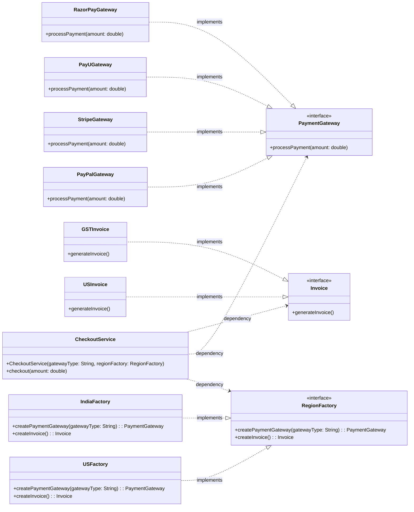

# Abstract Factory Pattern

Let us consider the example of a checkout system for any online purchase. It has steps like PaymentGateway, Invoice, etc.

```java
interface PaymentGateway{
    void processPayment(double amount);
}
class RazorPayGateway implements PaymentGateway{
    @Override
    public void processPayment(double amount) {
        System.out.println("Processing payment of " + amount + " through RazorPay");
    }
}
class PayUGateway implements PaymentGateway{
    @Override
    public void processPayment(double amount) {
        System.out.println("Processing payment of " + amount + " through PayU");
    }
}

interface Invoice{
    void generateInvoice();
}

class GSTInvoice implements Invoice{
    @Override
    public void generateInvoice() {
        System.out.println("Generating GST Invoice");
    }
}

class IndiaFactory{
    public static PaymentGateway createPaymentGateway(String gatewayType){
       switch(gatewayType){
           case "razorpay":
               return new RazorPayGateway();
           case "payu":
               return new PayUGateway();
           default:
               throw new IllegalArgumentException("Invalid gateway type");
       }
    }
    public static Invoice createInvoice(){
        return new GSTInvoice();
    }
}

class CheckoutService{
    private String gatewayType;

    public CheckoutService(String gatewayType){
        this.gatewayType = gatewayType;
    }
    /**
     * As we can see CheckoutService is violating the SRP and is getting concerned with object creation based on the gatewayType hence more than one responsibility. 
     */

    // public void checkout(double amount){
    //     if(gatewayType == "razorpay"){
    //         PaymentGateway gateway = new RazorPayGateway();
    //         gateway.processPayment(amount);
    //     }
    //     else if(gatewayType == "payu"){
    //         PaymentGateway gateway = new PayUGateway();
    //         gateway.processPayment(amount);
    //     }
    //     Invoice invoice = new GSTInvoice();
    //     invoice.generateInvoice();
    // }

    /**
     * Now we can see that CheckoutService is only concerned with the checkout process and not with the object creation. The object creation is delegated to the IndiaFactory which is responsible for creating the objects based on the gatewayType.
     * BUT WHAT IF YOU ARE OPERATING IN MULTIPLE COUNTRIES AND EACH COUNTRY HAS DIFFERENT PAYMENT GATEWAY AND INVOICE GENERATION LOGIC. THEN YOU WILL HAVE TO CREATE A FACTORY FOR EACH COUNTRY WHICH WILL VIOLATE THE OPEN/CLOSED PRINCIPLE.
     */
    public void checkout(double amount){
        PaymentGateway gateway = IndiaFactory.createPaymentGateway(gatewayType);
        gateway.processPayment(amount);
        Invoice invoice = IndiaFactory.createInvoice();
        invoice.generateInvoice();
    }
}
```

From  the above example, the problem can be seen clearly that the CheckoutService is violating the Single Responsibility Principle (SRP) and is getting concerned with object creation based on the gatewayType hence more than one responsibility. Even though we delegate the object creation to the one country factory, adding more will again force the CheckoutService to call country factories based no country type which will again violate the SRP. Hence we can use the Abstract Factory Pattern to solve this problem.

## Definition

A group of multple factories wrapped inside a single interface is called an Abstract Factory. 

It is a creational design pattern that provides an interface for creating families of related or dependent objects without specifying their concrete classes. 

- Abstract Class - 
  - Declares an interface for operations that create abstract product objects.
- Concrete Class - 
  - Implements the operations to create concrete product objects.


## Solution

```java
interface PaymentGateway{
    void processPayment(double amount);
}
class RazorPayGateway implements PaymentGateway{
    @Override
    public void processPayment(double amount) {
        System.out.println("Processing payment of " + amount + " through RazorPay");
    }
}
class PayUGateway implements PaymentGateway{
    @Override
    public void processPayment(double amount) {
        System.out.println("Processing payment of " + amount + " through PayU");
    }
}

interface Invoice{
    void generateInvoice();
}

class GSTInvoice implements Invoice{
    @Override
    public void generateInvoice() {
        System.out.println("Generating GST Invoice");
    }
}

interface RegionFactory{
    PaymentGateway createPaymentGateway(String gatewayType);
    Invoice createInvoice();
}

class IndiaFactory implements RegionFactory{
    public PaymentGateway createPaymentGateway(String gatewayType){
       switch(gatewayType){
           case "razorpay":
               return new RazorPayGateway();
           case "payu":
               return new PayUGateway();
           default:
               throw new IllegalArgumentException("Invalid gateway type");
       }
    }
    public static Invoice createInvoice(){
        return new GSTInvoice();
    }
}

class CheckoutService{
    private PaymentGateway paymentGateway;
    private String gatewayType;
    private Invoice invoice;

    public CheckoutService(String gatewayType, RegionFactory regionFactory){
        this.paymentGateway = regionFactory.createPaymentGateway(gatewayType);
        this.invoice = regionFactory.createInvoice();
    }

    public void checkout(double amount){
        paymentGateway.processPayment(amount);
        invoice.generateInvoice();
    }
}

class Main{
    public static void main(String[] args) {
        RegionFactory indiaFactory = new IndiaFactory();
        CheckoutService checkoutService = new CheckoutService("razorpay", indiaFactory);
        checkoutService.checkout(1000.0);
    }
}
```

Now, CheckoutService is not at all dealing with multiple region factories it simply delegates the region factory to create the required objects. Hence it is not violating the SRP and is only concerned with the checkout process.

Later, if we want to add US Factory, we would not be touching CheckoutService at all. We would simply create a new USFactory which implements the RegionFactory interface and pass it to the CheckoutService constructor. This way we are not violating the Open/Closed Principle as well.


## Pros

- **Consistency**: (Stripe + USInvoice) and (RazorPay + GSTInvoice) are consistent pairs of products. The Abstract Factory ensures that the client uses only compatible products together.

- **Decouples client from concrete implementations** : Client (checkoutService) doesn't know anything about the concrete classes of the products it uses. 

- **Promotes OCP**: Adding a new RegionFactory (e.g., USFactory) doesn't require changes to the CheckoutService class, adhering to the Open/Closed Principle.

- **Scalable & Flexible**: Adding PhonePe or any other payment gateway in India would not require any changes to the CheckoutService class. We would simply add a new case in the IndiaFactory and create a new class for PhonePeGateway.

- **Centralised Object Creation**: The Abstract Factory centralizes the creation of related objects, making it easier to manage and maintain.


## Cons

- **Complexity**: The Abstract Factory pattern can introduce additional complexity, especially for beginners.

- **Over-engineering**: For simple scenarios, using an Abstract Factory might be overkill and can lead to unnecessary complexity.   

- **Addition of more code**: Implementing the Abstract Factory pattern requires creating multiple interfaces and classes, which can lead to more code and potential maintenance overhead.


## Class Diagram (Specification Perspective)

