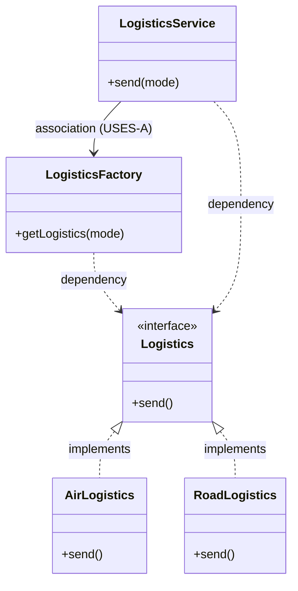

# Factory Creational Pattern

Let us consider an example of a Logistics Service where we have different types of transport services like road, air,etc.

```java
interface Logistics{
    void send();
}
class RoadLogistics implements Logistics{
    @Override
    public void send() {
        System.out.println("Sending via Road");
    }
}
class AirLogistics implements Logistics{
    @Override
    public void send() {
        System.out.println("Sending via Air");
    }
}
class LogisticsService{
    public void send(string mode){
        if(mode == "AIR"){
            Logistics logistics = new AirLogistics();
            logistics.send();
        }
        else if(mode == "ROAD"){
            Logistics logistics = new RoadLogistics();
            logistics.send();
        }
    }
}
```
Now, in the above scenario, if in case there comes another mode of transport like train, we will have to modify the `LogisticsService` class to add another condition for train. 

This is not a good design as it violates SOLID principles, because then we would have to modify the existing code to add new functionality.

Factory pattern is a design pattern that solves something like this.

## Definition

It is a creational design pattern that lets you create objects without telling the code exactly which class to use.

In simpler terms, rather than calling a constructor directly to create an object, we can use a factory method to create the object based on certain conditions or parameters. 


## When to use?

- When client code needs to work with multiple types of objects.
- The decision of which class to instantiate is made at runtime based on certain conditions or parameters.
- The instantiation logic is complex and needs to be controlled.

## Real-life example

You go to a laptop factory and ask for a certain laptop. The factory will create the laptop based on your requirements and give it to you. You don't need to know how the laptop is created or which components are used, you just get the final product.


## Implementing Logistics Factory

```java
interface Logistics{
    void send();
}
class AirLogistics implements Logistics{
    @Override
    public void send() {
        System.out.println("Sending via Air");
    }
}
class RoadLogistics implements Logistics{
    @Override
    public void send() {
        System.out.println("Sending via Road");
    }
}
class TrainLogistics implements Logistics{
    @Override
    public void send() {
        System.out.println("Sending via Train");
    }
}

class LogisticsFactory{
    public static Logistics getLogistics(String mode){
        if(mode == "AIR"){
            return new AirLogistics();
        }
        else if(mode == "ROAD"){
            return new RoadLogistics();
        }
        else if(mode == "TRAIN"){
            return new TrainLogistics();
        }
        else{
            throw new IllegalArgumentException("Invalid mode of transport");
        }
    }
}

class LogisticsService{
    public void send(String mode){
        Logistics logistics = LogisticsFactory.getLogistics(mode);
        logistics.send();
    }
}
```

That's it! Now, if we want to add a new mode of transport, we just need to create a new class that implements the `Logistics` interface and add a new condition in the `LogisticsFactory` class. The `LogisticsService` class remains unchanged, adhering to the `OCP` (Open/Closed Principle).


## Pros:

- **Loosely Coupled**: The client code is decoupled from the concrete classes, making it easier to maintain and extend.

- **Enhanced Extensibility**: Adheres to OCP (Open/Closed Principle) as we can add new types of objects without modifying existing code.

- **Centralized Object Creation**: Adhers to SRP (Single Responsibility Principle) as the object creation logic is centralized in the factory class, making it easier to manage and maintain.

- **Flexibility**: The factory pattern provides flexibility in terms of object creation, allowing for different implementations to be used based on certain conditions or parameters.


- **Code Reusability**: The factory pattern promotes code reusability by encapsulating the object creation logic in a single place, making it easier to reuse the code across different parts of the application.

## Cons:

- **Increased Complexity**: The factory pattern can introduce additional complexity to the codebase, especially if there are many different types of objects to create.

- **Code Overhead**: The factory pattern can introduce additional code overhead, as new developers may need to understand the factory class and its methods in order to use it effectively.

<br/>


## Class Diagram for Logistics Factory (Specification Perspective)

