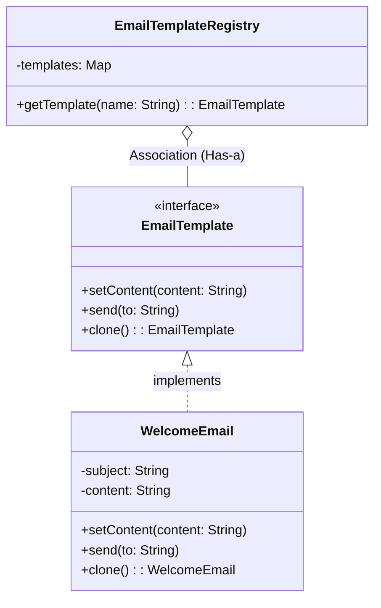

# Prototype Creational Design Pattern

Let us consider a scenario of sending an email to users of LeetCode and LeetCode Premium.

```java

interface EmailTemplate {
    void setContent(String content);
    void send(String to);
}

// A concrete email class, hardcoded
class WelcomeEmail implements EmailTemplate {
    private String subject;
    private String content;

    public WelcomeEmail() {
        this.subject = "Welcome to LeetCode!";
        this.content = "Hi there! Thanks for joining us.";
    }

    @Override
    public void setContent(String content) {
        this.content = content;
    }

    @Override
    public void send(String to) {
        System.out.println("Sending to " + to + ": [" + subject + "] " + content);
    }
}

class Main {
    public static void main(String[] args) {
        
        WelcomeEmail welcomeEmailLeetCode = new WelcomeEmail();
        welcomeEmailLeetCode.setContent("Hi there! Thanks for joining LeetCode.");
        
        WelcomeEmail welcomeEmailLeetCodePremium = new WelcomeEmail();
        welcomeEmailLeetCodePremium.setContent("Hi there! Thanks for joining LeetCode Premium.");
        
    }
}
```
We are creating two instances of `WelcomeEmail` class, one for LeetCode and another for LeetCode Premium. But the problem is that we are creating two separate instances of the same class whose main purpose remains the same. 

Here, one might think of using the Singleton pattern to solve the repeted creation of the same class. But the problem with Singleton is that it restricts its properties and methods to a single instance. A normal leetcode user and a premium leetcode user might have different properties and methods. Hence, we cannot use Singleton here.

So, Prototype pattern comes to the rescue to avoid the costly repetitive creation of the same class whilst also allowing for different purposes to exist.

## Definition

It is a creational design pattern used when the creation of an object is costly and time-consuming and we want to clone objects instead of creating new ones. 


## When to use?

- When object creation is Expensive (DB calls, expensive computations, etc.)

- When a system should be independent of how its products are created, composed, and represented.

- When you need to create a lot of similar objects with slight modifications. 

## How to implement?

```java
interface EmailTemplate extends Cloneable {
    void setContent(String content);
    void send(String to);
    EmailTemplate clone(); //Deep copy recommended
}

// Concrete Class implementing clone logic
class WelcomeEmail implements EmailTemplate {
    private String subject;
    private String content;

    public WelcomeEmail() {
        this.subject = "Welcome to TUF+";
        this.content = "Hi there! Thanks for joining us.";
    }

    @Override
    public WelcomeEmail clone() {
        try {
            return (WelcomeEmail) super.clone();
        } catch (CloneNotSupportedException e) {
            throw new RuntimeException("Clone failed", e);
        }
    }

    @Override
    public void setContent(String content) {
        this.content = content;
    }

    @Override
    public void send(String to) {
        System.out.println("Sending to " + to + ": [" + subject + "] " + content);
    }
}

class EmailTemplateRegistry {
    private static final Map<String, EmailTemplate> templates = new HashMap<>();

    static{
        templates.put("welcome", new WelcomeEmail()); //key is the name of the template 
        //more templates can be added here like "passwordReset", "newsletter", etc.
    }
    public EmailTemplate getTemplate(String name) {
        return templates.get(name).clone();
    }
}

public class Main{
    public static void main(String[] args) {
        EmailTemplateRegistry registry = new EmailTemplateRegistry();
        
        EmailTemplate welcomeEmailLeetCode = registry.getTemplate("welcome");
        welcomeEmailLeetCode.setContent("Hi there! Thanks for joining LeetCode.");
        
        EmailTemplate welcomeEmailLeetCodePremium = registry.getTemplate("welcome");
        welcomeEmailLeetCodePremium.setContent("Hi there! Thanks for joining LeetCode Premium.");
        
        welcomeEmailLeetCode.send("user1@leetcode.com");
        welcomeEmailLeetCodePremium.send("user2@leetcode.com");

    }
}
```


## Deep Copy vs Shallow Copy

- **Shallow Copy**: 
    - Only copies the reference of the object, not the actual object itself.
    - If internal objects are mutable and shared, both original and cloned will affect each other on changes.

- **Deep Copy**:
    - Recursively copies everything inside the object.
    - Safer but heavier in terms of performance and memory usage.


## Pros

- Faster object creation by cloning existing objects.
- Reduces subclassing (Already cloned objects can be used instead of creating new subclasses).
- Runtime object configuration (Directly use which object you want at runtime)
- Great for UI/UX cloning (e.g., copying a UI component with its properties).

## Cons
- Deep cloning can be complex.
- Difficult with circular references.
- Might introduce bugs.


## Class Diagram (Specification Perspective)

