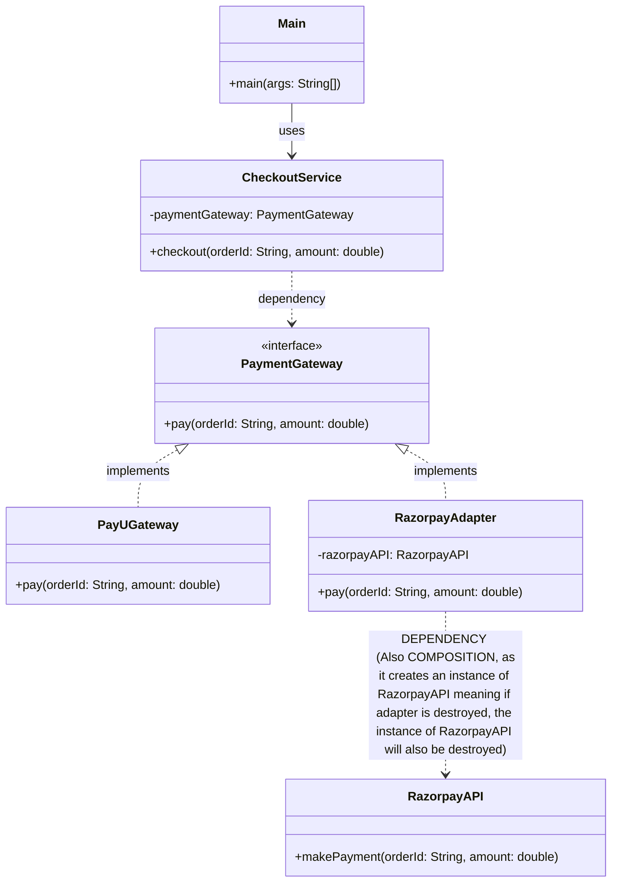

# Adapter Pattern

Let us consider the example of a payment gateway being used by a checkout service on any platform. 

```java
interface PaymentGateway{
    void pay(String orderId, double amount);
}

class PayUGateway implements PaymentGateway{
    @Override
    public void pay(String orderId, double amount) {
        System.out.println("Paying " + amount + " for order " + orderId + " using PayU Gateway");
    }
}

class RazorpayAPI{
    public void makePayment(String orderId, double amount) {
        System.out.println("Making payment of " + amount + " for order " + orderId + " using Razorpay API");
    }
}

class CheckoutService{
    private PaymentGateway paymentGateway;

    public CheckoutService(PaymentGateway paymentGateway) {
        this.paymentGateway = paymentGateway;
    }

    public void checkout(String orderId, double amount) {
        paymentGateway.pay(orderId, amount);
    }
}

class Main {
    public static void main(String[] args) {
        CheckoutService checkoutService = new CheckoutService(new PayUGateway());
        checkoutService.checkout("12345", 100.0);
    }
}
```

Now in the above example, we have a `PaymentGateway` interface that defines a method `pay`. The `PayUGateway` class implements this interface and provides its own implementation of the `pay` method. The `CheckoutService` class uses the `PaymentGateway` interface to process payments.

But if in future we want to use a different payment gateway, say Razorpay, which has a different method signature for making payments. THe current implementation of `CheckoutService` will not work with Razorpay API directly because it does not implement the `PaymentGateway` interface and has a different method signature.

Adapter pattern can be used to solve this problem. 

## Definition

The Adapter pattern is a structural design pattern that allows two incompatible interfaces to work with each other. 

It acts as a bridge between an interface that a client expects and the actual interface of existing classes. 

```java
class RazorpayAdapter implements PaymentGateway {
    private RazorpayAPI razorpayAPI;

    public RazorpayAdapter() {
        this.razorpayAPI = new RazorpayAPI();
    }

    @Override
    public void pay(String orderId, double amount) {
        razorpayAPI.makePayment(orderId, amount);
    }
}
class Main {
    public static void main(String[] args) {
        CheckoutService checkoutService = new CheckoutService(new RazorpayAdapter());
        checkoutService.checkout("12345", 100.0);
    }
}
```

## When to use Adapter Pattern

- We want to use an existing class, and its interface does not match the one we need.
- We want to reuse legacy code without modifying it.
- Integrating third-party libraries or APIs that have incompatible interfaces with our existing codebase.

## Pros

- **Code Reusability**: Adapter pattern allows us to reuse existing code without modifying it.
- **Code Extensibility**: It allows us to extend the functionality of existing classes without changing their code.
- **Minimal changes to client code**: The client code remains unchanged, as it interacts with the adapter through the expected interface.
- **Helps with integration**: It helps in integrating third-party libraries or APIs with incompatible interfaces.

## Cons

- **Extra layer of abstraction**: The adapter pattern introduces an additional layer of abstraction, which can increase complexity.
- **Overuse**: Overusing the adapter pattern can lead to a cluttered codebase with many adapters, making it harder to maintain and understand.

## Example in Real Products

- **Logging Frameworks**: Migrating different logging frameworks (e.g., Log4j, SLF4J) into an application can be done using adapters to provide a consistent logging interface.

- **Cloud Providers**: When integrating with different cloud providers (e.g., AWS, Azure, GCP), adapters can be used to provide a unified interface for cloud operations.

- **Payment Gateways**: As shown in the example, integrating multiple payment gateways (e.g., PayU, Razorpay, Stripe) can be achieved using adapters to provide a consistent payment interface.

## Class Diagram



