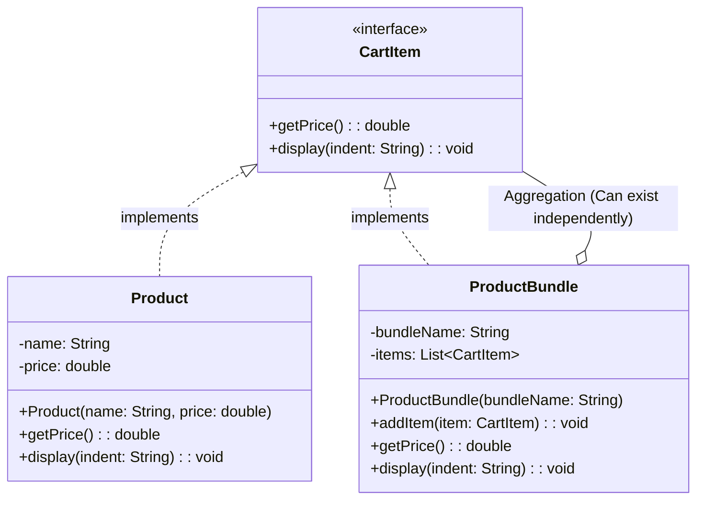

# Composite Pattern

Let us consider the example of Amazon Checkout. In Amazon Checkout, we have a list of products that a user can add to their cart. 
Some products are simple standalone products like IPhone, Macbook, etc. 
Soem products are in a bundle like a set of Iphone+Airpods, or a set of Macbook+AppleCare.

```java
class Product {
    String name;
    double price;
    
    public Product(String name, double price) {
        this.name = name;
        this.price = price;
    }
    
    public double getPrice() {
        return price;
    }

    public void display() {
        System.out.println(name + " - $" + price);
    }
}
class ProductBundle{
    private String bundleName;
    private List<Product> products = new ArrayList<>();

    public ProductBundle(String bundleName) {
        this.bundleName = bundleName;
    }

    public void addProduct(Product product) {
        products.add(product);
    }

    public double getPrice() {
        double totalPrice = 0;
        for (Product product : products) {
            totalPrice += product.getPrice();
        }
        return totalPrice;
    }

    public void display(String indent) {
        System.out.println(indent + "Bundle: " + bundleName);
        for (Product product : products) {
            product.display();
        }
        System.out.println(indent + "Total Price: $" + getPrice());
    }
}

class Main{
    public static void main(String[] args) {
        //Individual Products

        Product book = new Product("Book", 10.0);
        Product phone = new Product("Phone", 500.0);
        Product earbuds = new Product("Earbuds", 50.0);
        Product charger = new Product("Charger", 20.0);

        //Bundle Product: iPhone Combo
        ProductBundle iphoneCombo = new ProductBundle("iPhone Combo");
        iphoneCombo.addProduct(phone);
        iphoneCombo.addProduct(earbuds);
        iphoneCombo.addProduct(charger);


        //Bundle Product: School Kit
        ProductBundle schoolKit = new ProductBundle("School Kit");
        schoolKit.addProduct(new Product("Notebook", 5.0));
        schoolKit.addProduct(new Product("Pen", 2.0));
        schoolKit.addProduct(new Product("Backpack", 30.0));
        
        
        //Add to Cart - {Problem begins here}

        List<Object> cart = new ArrayList<>(); //Notice, we are saying type as "Object" which is not a good practice.
        cart.add(book);
        cart.add(iphoneCombo);
        card.add(schoolKit);

        //Display Cart Items
        System.out.println("Cart Items: (Without Composite Pattern)");

        double totalCartPrice = 0;

        for(Object item : cart) {
            if (item instanceof Product) {
                ((Product) item).display();
                totalCartPrice += ((Product) item).getPrice();
            } else if (item instanceof ProductBundle) {
                ((ProductBundle) item).display("  ");
                totalCartPrice += ((ProductBundle) item).getPrice();
            }
        }

        System.out.println("Total Cart Price: $" + totalCartPrice);
    }
}
```

Now, the above code works fine, but it is not a good design and will cause issues at scale. The main issue is that we are using a list of type `Object` to hold both `Product` and `ProductBundle`. This means that we have to check the type of each item in the cart and cast it accordingly, which is not ideal. We are telling our Client to explicitly worry about the type of the object they are dealing with. 

Composite Pattern is used to solve this problem. 

## Definition

It is a structural design pattern that lets you compose objects into tree structures to represent part-whole hierarchies. 

You can treat group of objects just like you would treat a single instance of an object.


```java
interface CartItem {
    double getPrice();
    void display(String indent);
}
class Product implements CartItem {
    String name;
    double price;
    
    public Product(String name, double price) {
        this.name = name;
        this.price = price;
    }
    
    @Override
    public double getPrice() {
        return price;
    }

    @Override
    public void display(String indent) {
        System.out.println(indent + name + " - $" + price);
    }
}

class ProductBundle implements CartItem {
    private String bundleName;
    private List<CartItem> items = new ArrayList<>(); // Notice, we are using CartItem type here, which is the interface implemented by both Product and ProductBundle.

    public ProductBundle(String bundleName) {
        this.bundleName = bundleName;
    }

    public void addItem(CartItem item) {
        items.add(item);
    }

    @Override
    public double getPrice() {
        double totalPrice = 0;
        for (CartItem item : items) {
            totalPrice += item.getPrice();
        }
        return totalPrice;
    }

    @Override
    public void display(String indent) {
        System.out.println(indent + "Bundle: " + bundleName);
        for (CartItem item : items) {
            item.display(indent + "  ");
        }
        System.out.println(indent + "Total Price: $" + getPrice());
    }
}

class Main {
    public static void main(String[] args) {
        // Individual Products
        CartItem book = new Product("Book", 10.0);
        CartItem phone = new Product("Phone", 500.0);
        CartItem earbuds = new Product("Earbuds", 50.0);
        CartItem charger = new Product("Charger", 20.0);

        // Bundle Product: iPhone Combo
        ProductBundle iphoneCombo = new ProductBundle("iPhone Combo"); //can initialise using CartItem type as well but it wont have "addItem" method, so we will use ProductBundle type here and add to cart later
        iphoneCombo.addItem(phone);
        iphoneCombo.addItem(earbuds);
        iphoneCombo.addItem(charger);

        // Bundle Product: School Kit
        ProductBundle schoolKit = new ProductBundle("School Kit");
        schoolKit.addItem(new Product("Notebook", 5.0));
        schoolKit.addItem(new Product("Pen", 2.0));
        schoolKit.addItem(new Product("Backpack", 30.0));

        // Add to Cart
        List<CartItem> cart = new ArrayList<>();
        cart.add(book);
        cart.add(iphoneCombo); //no error here, because both Product and ProductBundle implement CartItem interface
        cart.add(schoolKit);

        // Display Cart Items
        System.out.println("Cart Items: (With Composite Pattern)");

        double totalCartPrice = 0;

        for (CartItem item : cart) {
            item.display(" "); //no need to check type of item, because both Product and ProductBundle implement CartItem interface
            totalCartPrice += item.getPrice();
        }

        System.out.println("Total Cart Price: $" + totalCartPrice);
    }
}
```

We can see we are treating group of objects (ProductBundle) just like we would treat a single instance of an object (Product). This is the essence of the Composite Pattern.

**Leaf**: The leaf is the end object of a tree structure. In our example, the `Product` class is the leaf.
**Composite**: The composite is the object that has children. In our example, the `ProductBundle` class is the composite.

## When to use Composite Pattern

- You have a hierarchical structure of objects.(folders and files, organization structure, etc.)
- You want to treat individual and groups the same way.
- Yout want to avoid client-side logic to differentiate between leaf and composite objects.

## Pros
- **Uniformity**: Clients can treat individual objects and compositions uniformly.
- **Extensibility**: New types of components can be added without changing existing code.
- **Simplified Client Code**: The client code can be simplified as it doesn't need to differentiate between leaf and composite objects.
- **Supports Open/Closed Principle**: New components can be added without modifying existing code.


## Cons

- **Violates the Single Responsibility Principle**: The composite class can become complex as it has to manage both its own behavior and the behavior of its children.

- **Overkill for Simple Structures**: If the structure is simple and doesn't require a tree-like hierarchy, using the composite pattern can add unnecessary complexity.

- **In tightly coupled systems, uniform treatment can hide distinction between item types**: This can lead to confusion and make the system harder to understand and maintain. Example: Mutual Funds and Stocks. Both are investment products, but they have different characteristics and risk profiles. Treating them uniformly can lead to confusion and poor investment decisions.

## Class Diagram

