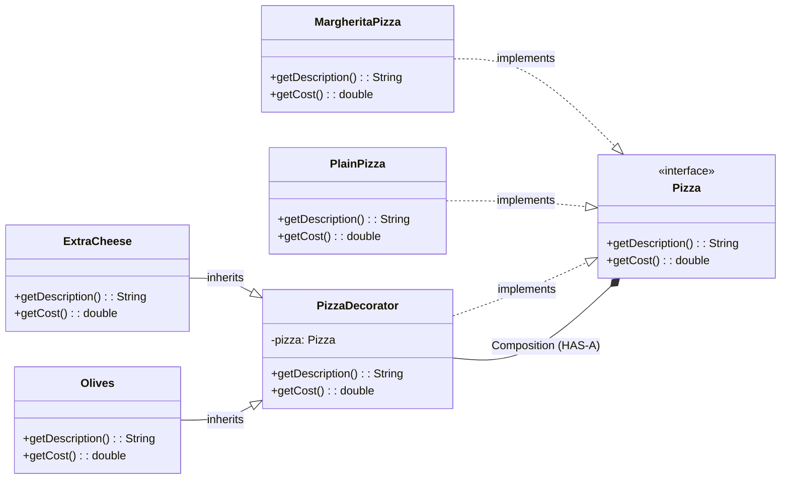

# Decorator Pattern

Let us consider a Pizza Deliver App, we are serving pizzas to customers with certain variations of ingredients.

```java
class PlainPizza{}
class CheesePizza extends PlainPizza{}
class OlivePizza extends PlainPizza{}
class CheeseOlivePizza extends CheesePizza{}
class CheeseOliveStuffedPizza extends CheeseOlivePizza{}
```

Now in the above example, we can see there are multiple classes for each variation of pizza. Imagine if we have N number of ingredients, then we will have to create 2^N classes for each variation of pizza. This is not a good design and will lead to class explosion. 

Decorator pattern is a structural design pattern that allows us to solve this problem.

## Definition

It is a structural design pattern that allows you to add new behaviour to objects dynamically at runtime without modifying their original structure. 


```java
interface Pizza {
    String getDescription();
    double getCost();
}

//Another kind of base of pizza
class PlainPizza implements Pizza {
    @Override
    public String getDescription() {
        return "Plain Pizza";
    }

    @Override
    public double getCost() {
        return 3.0;
    }
}

//Concrete Component (Base for the Pizza)
class MargheritaPizza implements Pizza {
    @Override
    public String getDescription() {
        return "Margherita Pizza";
    }

    @Override
    public double getCost() {
        return 5.0;
    }
}

//Decorator Abstract Class
abstract class PizzaDecorator implements Pizza {
    protected Pizza pizza; //HAS-A relationship

    public PizzaDecorator(Pizza pizza) {
        this.pizza = pizza;
    }

    @Override
    public String getDescription() {
        return pizza.getDescription();
    }

    @Override
    public double getCost() {
        return pizza.getCost();
    }
}

//Concrete Decorators
class ExtraCheese extends PizzaDecorator {
    public ExtraCheese(Pizza pizza) {
        super(pizza);
    }

    @Override
    public String getDescription() {
        return pizza.getDescription() + ", Extra Cheese";
    }

    @Override
    public double getCost() {
        return pizza.getCost() + 1.5;
    }
}

//Concrete Decorator for Olives

class Olives extends PizzaDecorator {
    public Olives(Pizza pizza) {
        super(pizza);
    }

    @Override
    public String getDescription() {
        return pizza.getDescription() + ", Olives";
    }

    @Override
    public double getCost() {
        return pizza.getCost() + 1.0;
    }
}

public class Main{
    public static void main(String[] args) {
        Pizza margheritaPizza = new MargheritaPizza();
        System.out.println(margheritaPizza.getDescription() + " Cost: " + margheritaPizza.getCost());

        Pizza cheesePizza = new ExtraCheese(margheritaPizza); //Just add cheese to the existing pizza without creating a new class
        System.out.println(cheesePizza.getDescription() + " Cost: " + cheesePizza.getCost());

        Pizza plainPizza = new PlainPizza();
        Pizza plainCheesePizza = new ExtraCheese(plainPizza); //Just add cheese to the existing pizza without creating a new class
        System.out.println(plainCheesePizza.getDescription() + " Cost: " + plainCheesePizza.getCost());

        Pizza plainCheeseOlivePizza = new Olives(plainCheesePizza); //Just add olives to the existing plain+cheese pizza without creating a new class
        System.out.println(plainCheeseOlivePizza.getDescription() + " Cost: " + plainCheeseOlivePizza.getCost());
    }
}
```

As we can see in the above example, we have created a base interface `Pizza` and a concrete class `PlainPizza` and `MargheritaPizza`. We have also created an abstract decorator class `PizzaDecorator` which implements the `Pizza` interface and has a HAS-A relationship with the `Pizza` interface.

Now we can create concrete decorators like `ExtraCheese` and `Olives` which extend the `PizzaDecorator` class and add new behaviour to the existing pizza objects without modifying their original structure.

Therefore, we can create any combination of pizza with different ingredients without creating a new class for each variation. This is the power of the Decorator pattern.


## Key Takeaways

- Abstract classes can have constructors and they do get executed when a subclass is instantiated. 

- Each decorator is a layer like wrapping gift boxes, and each one just adds behavior to the one it wraps.

- The decorator pattern  works like call stack where behavious is accumulated as calls.

## When to use Decorator Pattern

- You need to add responsibilities to objects dynamically.
- To avoid explosion of subclasses for every combination of behaviors.
- Follow Open/Closed Principle, (Not touching PlainPizza or MargheritaPizza classes, but extending their functionality).

- Reusable and composable behavior can be achieved by using decorators. You can mix and match decorators to create different combinations of behavior.

- You need layered step by step behavior.


## Pros

- **Follows Open/Closed Principle**: You can add new functionality to existing classes without modifying their code.

-   **Runtime flexibility**: To compose features at runtime, you can use decorators to add or remove features dynamically.

- **Avoids class explosion**: Instead of creating a new subclass for every combination of features, you can use decorators to create different combinations of features.

- **Single Responsibility Principle**: Each decorator class has a single responsibility, which makes it easier to maintain and understand.

## Cons

- **Small classes**: Can result in smaller classes
- **Stack trace**: It can be difficult to debug the stack trace when using decorators, as the call stack can become long and complex.

- **Wrapper overhead**: Each decorator adds a layer of wrapping around the original object, which can introduce some overhead in terms of performance and memory usage.

- **Developer understanding**: It can be difficult for developers to understand the code when using decorators, especially if there are many layers of decorators.

## Real World Example

Text editors like Microsoft Word or Google Docs use the decorator pattern to add features like bold, italic, underline, and other formatting options to text. Each formatting option can be implemented as a decorator that wraps the original text object and adds new behavior.

## Class Diagram

