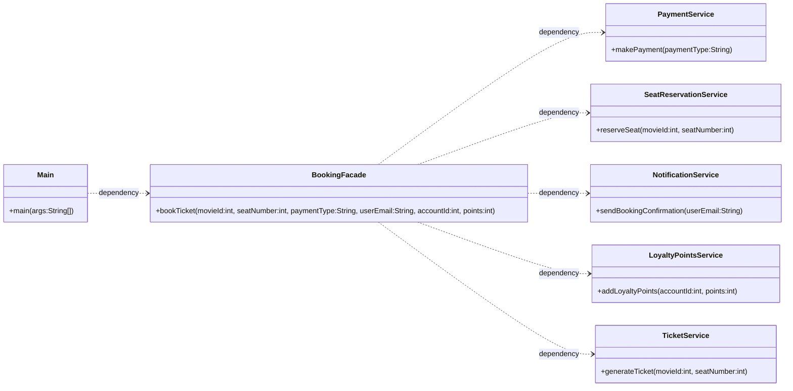

# Facade Pattern

Let us consider the example of BookMyShow, where we are booking tickets for a movie. The process of booking a ticket involves multiple steps like selecting Payment,Seat Reservation, Notification, Loyalty Points.

```java
class PaymentService{
    public void makePayment(String paymentType){
        System.out.println("Payment done using "+paymentType);
    }
}
class SeatReservationService{
    public void reserveSeat(int movieId, int seatNumber){
        System.out.println("Seat "+seatNumber+" reserved for movie "+movieId);
    }
}
class NotificationService{
    public void sendBookingConfirmation(String userEmail){
        System.out.println("Notification sent to "+userEmail);
    }
}
class LoyaltyPointsService{
    public void addLoyaltyPoints(int accountId,int points){
        System.out.println(points+" loyalty points added to account "+accountId);
    }
}

class TicketService{
    public void generateTicket(int movieId, int seatNumber){
        System.out.println("Ticket generated for movie "+movieId+" at seat number "+seatNumber);
    }
}

class Main{
    public static void main(String[] args) {
        //Booking a seat manually

        PaymentService paymentService = new PaymentService();
        paymentService.makePayment("Credit Card");

        SeatReservationService seatReservationService = new SeatReservationService();
        seatReservationService.reserveSeat(101, 5);

        NotificationService notificationService = new NotificationService();
        notificationService.sendBookingConfirmation("user@example.com");

        LoyaltyPointsService loyaltyPointsService = new LoyaltyPointsService();
        loyaltyPointsService.addLoyaltyPoints(1001, 100);

        TicketService ticketService = new TicketService();
        ticketService.generateTicket(101, 5);

    }
}
```

Now, in the above example, the client has to interact with multiple services to book a ticket, and each time they had to strictly follow the order of operations. This can be cumbersome and error-prone when there are multiple kinds of clients like comedyShow, cinema, drama, etc. and each of them has different requirements for booking a ticket. Each client has to know the order of operations and which services to call, which can lead to code duplication and maintenance issues.

To avoid such repetitive code and to provide a simpler interface to the clients, we use the Facade pattern.


## Definition

It is a structural design pattern that provides a simplified,unified interface to a set of interfaces in a subsystem.


## Real World Example

Manual Cars require the driver to operate the clutch, gear, accelerator, and brake pedals.

Automatic Cars, on the other hand, provide a simplified interface to the driver by eliminating the need for manual gear shifting. The driver only needs to operate the accelerator and brake pedals, while the car's internal system takes care of the gear shifting automatically.

## Implementation

```java

class BookingFacade{
    private PaymentService paymentService;
    private SeatReservationService seatReservationService;
    private NotificationService notificationService;
    private LoyaltyPointsService loyaltyPointsService;
    private TicketService ticketService;

    public BookingFacade(){
        this.paymentService = new PaymentService();
        this.seatReservationService = new SeatReservationService();
        this.notificationService = new NotificationService();
        this.loyaltyPointsService = new LoyaltyPointsService();
        this.ticketService = new TicketService();
    }

    public void bookTicket(int movieId, int seatNumber, String paymentType, String userEmail, int accountId, int points){
        paymentService.makePayment(paymentType);
        seatReservationService.reserveSeat(movieId, seatNumber);
        notificationService.sendBookingConfirmation(userEmail);
        loyaltyPointsService.addLoyaltyPoints(accountId, points);
        ticketService.generateTicket(movieId, seatNumber);
    }
}

class Main{
    public static void main(String[] args) {
        //Booking a seat using Facade
        BookingFacade bookingFacade = new BookingFacade();
        bookingFacade.bookTicket(101, 5, "Credit Card", "user@example.com", 1001, 100);

        System.out.println("Ticket booking completed successfully!");
    }
}
```

## When to use Facade Pattern

- Subsystems are complex and difficult to understand (too many classes, too many dependencies, etc.)
- You want to provide a simple API for the outer world to interact with the subsystem.
- You want to reduce complexity and dependencies between the client and the subsystem.
- You want to layer your architecture cleanly, with a clear separation of concerns between the different layers.

## Pros

- **Lightweight Coupling**: The Facade pattern reduces the coupling between the client and the subsystem, making it easier to change the subsystem without affecting the client.

- **Flexibility**: The Facade pattern allows you to change the implementation of the subsystem without affecting the client, as long as the interface remains the same.

- **Simplifies Client Design**: The Facade pattern provides a simple interface to the client, making it easier to use and understand.

- **Promotes Layered Architecture**: The Facade pattern promotes a layered architecture, where the client interacts with the facade layer, which in turn interacts with the subsystem layer.

- **Better Testability**: The Facade pattern makes it easier to test the subsystem, as you can test the facade layer independently of the subsystem layer.

## Cons

- **Fragile Coupling**: If the facade layer is tightly coupled to the subsystem layer, changes in the subsystem can break the facade layer, which can lead to a fragile design.

- **Hidden Complexity**: The Facade pattern can hide the complexity of the subsystem, which can make it difficult to understand how the subsystem works and how to use it effectively.

- **Runtime Errors**: If the facade layer does not handle errors properly, it can lead to runtime errors that are difficult to debug and fix.

- **Difficult to Trace**: If the facade layer is not well-documented, it can be difficult to trace the flow of control and understand how the subsystem works.

- **Violation of Single Responsibility Principle**: The facade layer can become a "god object" that has too many responsibilities, which can make it difficult to maintain and understand.


------


**ALWAYS TRY TO DEPEND ON ABSTRACTIONS(INTERFACES), NOT CONCRETE CLASSES TO MINIMISE TIGHT COUPLING**

---

## Class Diagram

