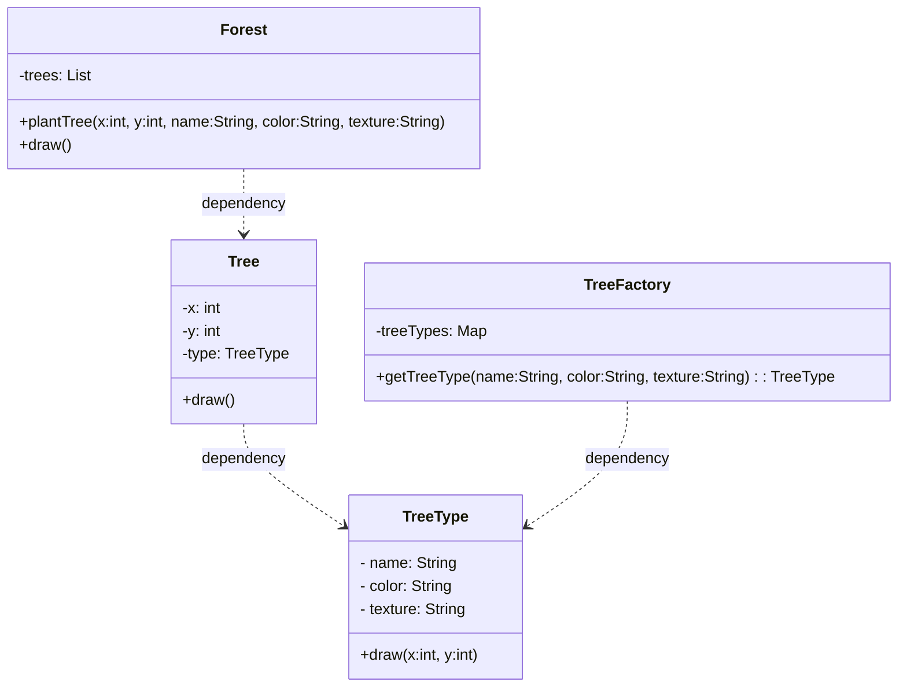

# Flyweight Pattern

Let us consider the case of showing trees on Google Maps where each tree has its own coordinates, name,color,texture,etc.

```java
class Tree{
    //keeps changing
    private int x;
    private int y;
    //does not change (constant)
    private String name;
    private String color;
    private String texture;

    public Tree(int x, int y, String name, String color, String texture) {
        this.x = x;
        this.y = y;
        this.name = name;
        this.color = color;
        this.texture = texture;
    }

    public void draw(){
        System.out.println("Drawing tree " + name + " at (" + x + ", " + y + ") with color " + color + " and texture " + texture);
    }
}

class Forest{
    private List<Tree> trees = new ArrayList<>();

    public void plantTree(int x, int y, String name, String color, String texture) {
        Tree tree = new Tree(x, y, name, color, texture);
        trees.add(tree);
    }

    public void draw() {
        for (Tree tree : trees) {
            tree.draw();
        }
    }
}


//Say Client is planting 1million trees
class Main{
    Forest forest = new Forest();

    for(int i = 0; i < 1000000; i++) {
        forest.plantTree(i, i, "Oak", "Green", "Rough");
    }
}
```

As we can see in the above example, we are creating 1 million tree objects, and each tree object has its own coordinates, name, color, and texture even though the name, color, and texture are the same for all trees. This is a waste of memory as we are storing the same data multiple times. To avoid this, we can use the Flyweight pattern.

## Definition

It is a structural design pattern which is used to minimize memory usage by sharing as much data as possible with similar objects. 

Think of it as a data re-use pattern, if many objects are similar, we store the common data in one place and share it across instances.


### Intrinsic & Extrinsic Attributes


- **Intrinsic Attributes**: These are the attributes that are shared among all instances of a class. In our example, the name, color, and texture of the tree are intrinsic attributes as they are the same for all trees.

- **Extrinsic Attributes**: These are the attributes that are unique to each instance of a class. In our example, the x and y coordinates of the tree are extrinsic attributes as they are different for each tree.

## Implementation

```java
class TreeType{
    private String name;
    private String color;
    private String texture;

    public TreeType(String name, String color, String texture) {
        this.name = name;
        this.color = color;
        this.texture = texture;
    }

    public void draw(int x, int y){
        System.out.println("Drawing tree " + name + " at (" + x + ", " + y + ") with color " + color + " and texture " + texture);
    }
}
class Tree{
    int x;
    int y;
    TreeType type;

    public Tree(int x, int y, TreeType type) {
        this.x = x;
        this.y = y;
        this.type = type;
    }

    public void draw(){
        type.draw(x, y);
    }
}

class TreeFactory{
    private static Map<String, TreeType> treeTypes = new HashMap<>();

    public static TreeType getTreeType(String name, String color, String texture) {
        String key = name + "-" + color + "-" + texture;
        if (!treeTypes.containsKey(key)) {
            treeTypes.put(key, new TreeType(name, color, texture));
        }
        return treeTypes.get(key);
    }
}

class Forest{
    private List<Tree> trees = new ArrayList<>();
    
    public void plantTree(int x, int y, String name, String color, String texture) {
        TreeType type = TreeFactory.getTreeType(name, color, texture);
        Tree tree = new Tree(x, y, type); //only x and y are unique for each tree, the rest of the attributes are shared
        trees.add(tree);
    }

    public void draw() {
        for (Tree tree : trees) {
            tree.draw();
        }
    }
}

class Main{
    public static void main(String[] args) {
        Forest forest = new Forest();

        for(int i = 0; i < 1000000; i++) {
            forest.plantTree(i, i, "Oak", "Green", "Rough");
        }

        forest.draw();
    }
}
```

## When to use Flyweight Pattern

- When you need to create a large number of similar objects that share common data. (Rides in Uber, Trees in Google Maps, etc.)

- When memory and performance optimization is a concern, and you want to reduce the memory footprint of your application.

- When the object's intrinsic properties can be shared independently of its extrinsic properties, allowing for efficient reuse of the shared data.


## Pros

- **Memory Efficiency**: The Flyweight pattern reduces memory usage by sharing common data among similar objects, which can lead to significant memory savings in applications that require a large number of objects.

- **Performance Improvement**: By reducing the number of objects created, the Flyweight pattern can improve performance, especially in scenarios where object creation is expensive.

- **Faster Object Creation**: The Flyweight pattern allows for faster object creation, as it reuses existing objects instead of creating new ones.

## Cons

- **Complexity**: The Flyweight pattern can introduce complexity into the codebase, as it requires both Factory + Management of shared objects and careful handling of intrinsic and extrinsic properties.

- **Harder to Debug**: The Flyweight pattern can make debugging more difficult, as it can be harder to trace the flow of data and understand how shared objects are being used.


- **Tight Coupling**: The Flyweight pattern can lead to tight coupling between the shared objects and the client code, which can make it harder to change the implementation of the shared objects without affecting the client code.

## Class Diagram

