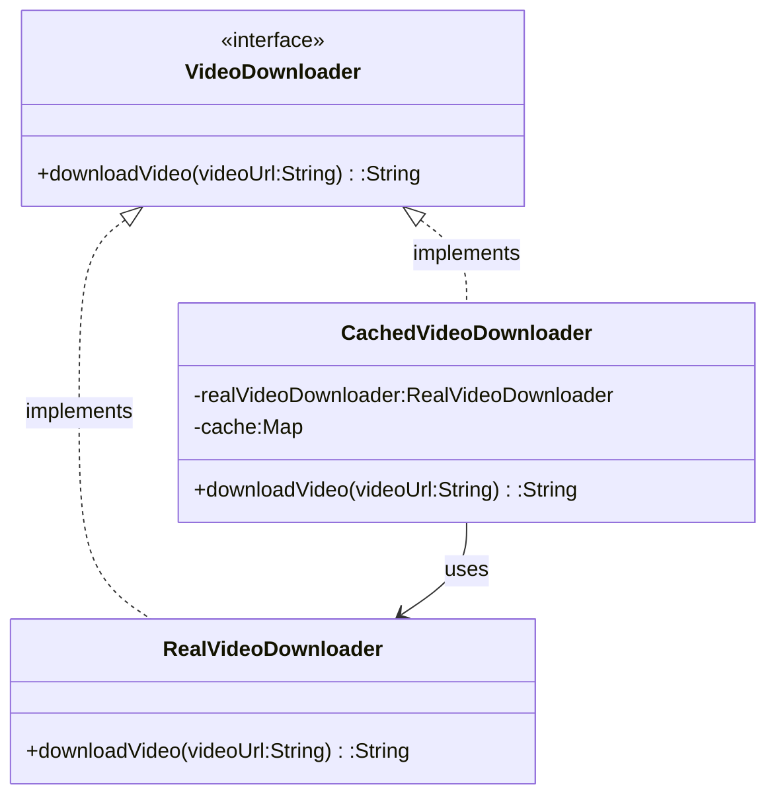

# Proxy Pattern

Let us consider the example of where multiple clients are downloading a particular video using its video URL. The video is stored on a remote server and the client has to download it from there. The video is large in size and takes a lot of time to download. 

```java

class RealVideoDownloader{
    public String downloadVideo(String videoUrl){
        System.out.println("Downloading video from "+videoUrl);
        return "Video data";
    }
}

class Main{
    public static void main(String[] args) {
        RealVideoDownloader realVideoDownloader = new RealVideoDownloader();
        realVideoDownloader.downloadVideo(
            "proxy-pattern-video-url"
        );

        RealVideoDownloader realVideoDownloader2 = new RealVideoDownloader();
        realVideoDownloader2.downloadVideo(
            "proxy-pattern-video-url"
        )
    }
}

```

In the above example, we are downloading the same video twice from the remote server, which is a waste of time and bandwidth. We should try to avoid downloading the same video multiple times and memoize it. 

Maybe we also want to implement access control,filtering, logging, etc. for the video download. If we put all these functionalities in the RealVideoDownloader class, it will become bloated and hard to maintain.

To avoid this, we can use the Proxy pattern.

## Definition

It is a structural design pattern that provides a surrogate or placeholder for another object to control access to it. 

Think of it like a security guard who controls access real VIP.

**Key Idea**

Instead of interacting with the real object directly, clients interact with a proxy object that acts on behalf of the real object. 

**Real-life Examples**

Firewall,caching,filtering,protection, privacy, logging, etc. are some of the real-life examples of Proxy pattern.

## Implementation

```java
interface VideoDownloader{
    String downloadVideo(String videoUrl);
}


class RealVideoDownloader implements VideoDownloader{

    @Override
    public String downloadVideo(String videoUrl){
        System.out.println("Downloading video from "+videoUrl);
        return "Video data";
    }
}


class CachedVideoDownloader implements VideoDownloader{
    private RealVideoDownloader realVideoDownloader;
    private Map<String,String> cache = new HashMap<>();

    @Override
    public String downloadVideo(String videoUrl){
        if(cache.containsKey(videoUrl)){
            System.out.println("Returning cached video for "+videoUrl);
            return cache.get(videoUrl);
        }
        System.out.println("Cache miss, Downloading video from "+videoUrl);
        String video = realVideoDownloader.downloadVideo(videoUrl);
        cache.put(videoUrl,video);
        return video;
    }
}

class Main{
    public static void main(String[] args) {
        VideoDownloader videoDownloader = new CachedVideoDownloader();
        videoDownloader.downloadVideo("proxy-pattern-video-url");

        VideoDownloader videoDownloader2 = new CachedVideoDownloader();
        videoDownloader2.downloadVideo("proxy-pattern-video-url"); //will return cached video instead of downloading it again
    }
}
```


## When to use Proxy Pattern

- When object creation is expensive and you want to delay the creation of the object until it is actually needed.

- When you want to control access to sensitive operations or add permission checks before allowing access to certain methods.

- When interacting with a remote object.

- When you need lazy loading for your system, where the object is only created when it is actually needed.


## Types of Proxy


- **Virtual Proxy**: Controls access to a resource that is expensive to create. It creates the resource only when it is actually needed.

- **Protection Proxy**: Controls access to a resource based on permissions. It checks if the client has the necessary permissions before allowing access to the resource.

- **Remote Proxy**: Controls access to a resource that is located remotely.

- **Smart Proxy**: Adds extra behavior during the access to a resource. It can be used for logging, caching, etc.

## Pros

- **Performance Improvement**: The Proxy pattern can improve performance by caching results and avoiding expensive operations.

- **Access Control**: The Proxy pattern can be used to control access to sensitive operations and add permission checks before allowing access to certain methods.

- **Lazy Loading**: The Proxy pattern can be used to implement lazy loading, where the object is only created when it is actually needed.

- **Extra Functionality**: The Proxy pattern can be used to add extra functionality during the access to a resource, such as logging, caching, etc.

## Cons

- **Increased Complexity**: The Proxy pattern can increase the complexity of the codebase, as it introduces an additional layer of abstraction.

- **Delay in Access**: The Proxy pattern can introduce a delay in access to the real object, as the proxy needs to perform additional checks or operations before allowing access to the real object.

- **Maintenance Overhead**: The Proxy pattern can introduce maintenance overhead, as changes to the real object may require changes to the proxy as well.


## Class Diagram

