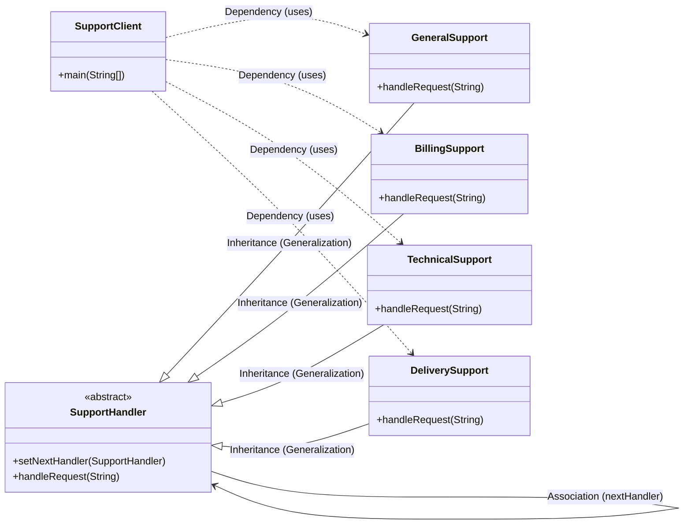

# Chain of Responsibility Pattern

Let us consider a customer support system  for an e-commerce application where a customer can raise a support ticket.

These tickets could be:
- "General Inquiry"
- "Technical Issue"
- "Refund Request"
- "Delivery Complaint"

```java
class SupportService{
    public void handleRequest(String requestType) {
        if (requestType.equals("General Inquiry")) {
            System.out.println("Handling General Inquiry.");
        } else if (requestType.equals("Technical Issue")) {
            System.out.println("Handling Technical Issue.");
        } else if (requestType.equals("Refund Request")) {
            System.out.println("Handling Refund Request.");
        } else if (requestType.equals("Delivery Complaint")) {
            System.out.println("Handling Delivery Complaint.");
        } else {
            System.out.println("No handler available for this request type.");
        }
    }
}
```

Now above code violates the Open/Closed Principle because if we want to add a new request type, we would have to modify the `handleRequest` method.

Violates Single Responsibility Principle because the `SupportService` class is responsible for handling all types of requests.

Not flexible or scalable because we cannot change the order of logic without modifying the existing code.

## Definition

It is a behavioral design pattern that transforms particular behaviour into stand-alone objects called **handlers**. 

It allows a request to be passed along a chain of handlers. Each handler decides either to process the request or to pass it to the next handler in the chain.

This pattern decouples the sender of a request from its receivers, giving multiple objects a chance to handle the object.

## Implementation

```java
abstract class SupportHandler {
    protected SupportHandler nextHandler;

    public void setNextHandler(SupportHandler nextHandler) {
        this.nextHandler = nextHandler;
    }

    public abstract void handleRequest(String requestType);
}
// Concrete Handler for General Support
class GeneralSupport extends SupportHandler {
    public void handleRequest(String requestType) {
        if (requestType.equalsIgnoreCase("general")) {
            System.out.println("GeneralSupport: Handling general query");
        } else if (nextHandler != null) {
            nextHandler.handleRequest(requestType);
        }
    }
}

// Concrete Handler for Billing Support
class BillingSupport extends SupportHandler {
    public void handleRequest(String requestType) {
        if (requestType.equalsIgnoreCase("refund")) {
            System.out.println("BillingSupport: Handling refund request");
        } else if (nextHandler != null) {
            nextHandler.handleRequest(requestType);
        }
    }
}

// Concrete Handler for Technical Support
class TechnicalSupport extends SupportHandler {
    public void handleRequest(String requestType) {
        if (requestType.equalsIgnoreCase("technical")) {
            System.out.println("TechnicalSupport: Handling technical issue");
        } else if (nextHandler != null) {
            nextHandler.handleRequest(requestType);
        }
    }
}

// Concrete Handler for Delivery Support
class DeliverySupport extends SupportHandler {
    public void handleRequest(String requestType) {
        if (requestType.equalsIgnoreCase("delivery")) {
            System.out.println("DeliverySupport: Handling delivery issue");
        } else if (nextHandler != null) {
            nextHandler.handleRequest(requestType);
        } else {
            System.out.println("DeliverySupport: No handler found for request");
        }
    }
}

class Main{
     public static void main(String[] args) {
        SupportHandler general = new GeneralSupport();
        SupportHandler billing = new BillingSupport();
        SupportHandler technical = new TechnicalSupport();
        SupportHandler delivery = new DeliverySupport();

        // Setting up the chain: general -> billing -> technical -> delivery
        general.setNextHandler(billing);
        billing.setNextHandler(technical);
        technical.setNextHandler(delivery);

        // Testing the chain of responsibility with different request types
        general.handleRequest("refund");
        general.handleRequest("delivery");
        general.handleRequest("unknown");
    }
}
```

## When to use?

- When multiple objects can handle a request but the handler is not known beforehand.
- When you want to decouple the sender of a request from its receivers.
- When you want to dynamically specify the chain of processing.

## Pros

- **Decoupling**: The sender and receiver are decoupled, allowing for more flexible code.
- **Flexibility**: New handlers can be added or removed without changing the existing code.
- **OCP & SRP**: Each handler has a single responsibility and can be extended without modifying existing code.
- **Dynamic Chain**: The chain of handlers has dynamic control over handler execution sequence.

## Cons

- **Perfomance Issues**: If the chain is too long, it may lead to performance issues as each handler is checked sequentially.
- **Hard to Debug**: It can be difficult to debug due to the dynamic nature of the chain and the fact that the request may be passed through multiple handlers.
- **Unhandled Requests**: If no handler can process the request, it may lead to unhandled requests unless explicitly managed.
- **Wrong Handler Order**: The order of handlers in the chain is crucial. If not set correctly, it may break logic or lead to unexpected behavior.

## Real-world Examples

- **Sign-up Process**: Email -> SMS -> Phone Verification OR
Google Authenticator -> user verification -> account activation.

## Class Diagram


