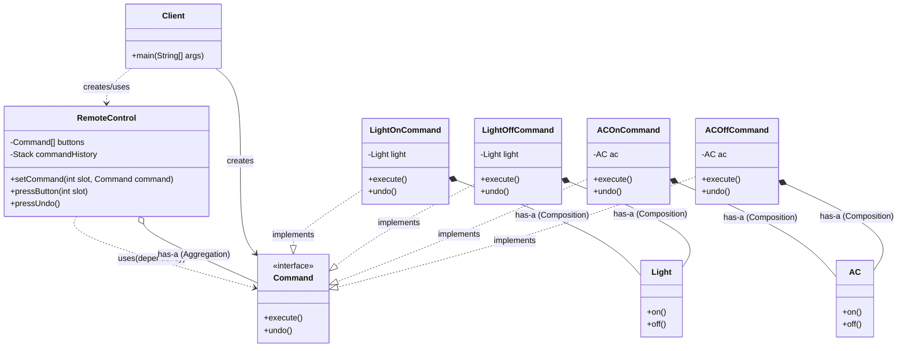

# Command Pattern

Let us consider a scenario where we have a light with on and off functionality, similarly and AC (Air Conditioner) with on and off functionality and to command these devices we have a naive remote control.

```java
//Receiver
class Light {
    public void on() {
        System.out.println("Light is ON");
    }

    public void off() {
        System.out.println("Light is OFF");
    }
}

class AC {
    public void on() {
        System.out.println("AC is ON");
    }

    public void off() {
        System.out.println("AC is OFF");
    }
}

class NaiveRemoteControl {
    private Light light;
    private AC ac;
    private String lastAction = "";

    public NaiveRemoteControl(Light light, AC ac) {
        this.light = light;
        this.ac = ac;
    }

    public void pressLightOn() {
        light.on();
        lastAction = "Light ON";
    }
    public void pressLightOff() {
        light.off();
        lastAction = "Light OFF";
    }

    public void pressACOn() {
        ac.on();
        lastAction = "AC ON";
    }

    public void pressACOff() {
        ac.off();
        lastAction = "AC OFF";
    }

    public void pressUndo() {
        switch (lastAction) {
            case "Light ON":
                light.off();
                break;
            case "Light OFF":
                light.on();
                break;
            case "AC ON":
                ac.off();
                break;
            case "AC OFF":
                ac.on();
                break;
            default:
                System.out.println("No action to undo");
        }
    }
}

class Main {
    public static void main(String[] args) {
        Light light = new Light();
        AC ac = new AC();
        NaiveRemoteControl remoteControl = new NaiveRemoteControl(light, ac);

        remoteControl.pressLightOn();
        remoteControl.pressACOn();
        remoteControl.pressLightOff();
        remoteControl.pressACOff();
        remoteControl.pressUndo(); //should turn AC back ON
        remoteControl.pressUndo(); //should turn Light back ON
    }
}
```

AS we can see in the above code, the `NaiveRemoteControl` class is tightly coupled with the `Light` and `AC` classes. If we want to add more devices or change the functionality of the existing devices, we would have to modify the `NaiveRemoteControl` class, which violates the Open/Closed Principle.

Also, the `pressUndo` method is not scalable as it uses a switch statement to determine the last action performed. If we add more devices or actions, we would have to modify this method as well.

We also cant maintain a history of actions performed, as we are only storing the last action in a single variable. If we want to implement a more complex undo functionality, we would have to change the implementation of the `NaiveRemoteControl` class.

## Definition

It is a behavioral design pattern that turns a request into a separate object, allowing you to decouple the code that issues the request from the code that performs it.

This lets you add features like undo/redo, logging, and dynamic command execution without changing the core business logic.

### Four Key Components of Command Pattern

1. **Client** : The client is responsible for setting the Invoker.

2. **Invoker** : The invoker is responsible for executing the command. It does not know what the command does, it just knows how to execute it.

3. **Command** : The command is an interface that declares a method for executing a command.

4. **Receiver** : The receiver is the object that knows how to perform the work needed to carry out the request. Any class may serve as a Receiver.

## Implementation

```java
//Command interface
interface Command {
    void execute();
    void undo();
}
class LightOnCommand implements Command {
    private Light light;

    public LightOnCommand(Light light) {
        this.light = light;
    }

    @Override
    public void execute() {
        light.on();
    }

    @Override
    public void undo() {
        light.off();
    }
}
class LightOffCommand implements Command {
    private Light light;

    public LightOffCommand(Light light) {
        this.light = light;
    }

    @Override
    public void execute() {
        light.off();
    }

    @Override
    public void undo() {
        light.on();
    }
}
class ACOnCommand implements Command {
    private AC ac;

    public ACOnCommand(AC ac) {
        this.ac = ac;
    }

    @Override
    public void execute() {
        ac.on();
    }

    @Override
    public void undo() {
        ac.off();
    }
}
class ACOffCommand implements Command {
    private AC ac;

    public ACOffCommand(AC ac) {
        this.ac = ac;
    }

    @Override
    public void execute() {
        ac.off();
    }

    @Override
    public void undo() {
        ac.on();
    }
}

//Invoker - 4 commands
class RemoteControl{
    private Command[] buttons = new Command[4];
    private Stack<Command> commandHistory = new Stack<>();

    public void setCommand(int slot, Command command) {
        buttons[slot] = command;
    }

    public void pressButton(int slot) {
        if(buttons[slot] != null) {
            buttons[slot].execute();
        } else {
            System.out.println("No command assigned to this button");
        }
    }

    public void pressUndo() {
        if(!commandHistory.isEmpty()) {
            Command lastCommand = commandHistory.pop();
            lastCommand.undo();
        } else {
            System.out.println("No command to undo");
        }
    }
}

class Main {
    public static void main(String[] args) {
        Light light = new Light();
        AC ac = new AC();

        Command lightOn = new LightOnCommand(light);
        Command lightOff = new LightOffCommand(light);
        Command acOn = new ACOnCommand(ac);
        Command acOff = new ACOffCommand(ac);

        RemoteControl remoteControl = new RemoteControl();
        remoteControl.setCommand(0, lightOn);
        remoteControl.setCommand(1, lightOff);
        remoteControl.setCommand(2, acOn);
        remoteControl.setCommand(3, acOff);

        remoteControl.pressButton(0); // Light ON
        remoteControl.pressButton(2); // AC ON
        remoteControl.pressButton(1); // Light OFF
        remoteControl.pressButton(3); // AC OFF
        remoteControl.pressUndo(); // should turn AC back ON
        remoteControl.pressUndo(); // should turn Light back ON
    }
}
```

As we can see in the above code, we have created a `Command` interface that declares the `execute` and `undo` methods. We have created concrete command classes for each action (LightOnCommand, LightOffCommand, ACOnCommand, ACOffCommand) that implement the `Command` interface.

The `RemoteControl` Invoker class is now decoupled from the `Light` and `AC` classes. It only knows about the `Command` interface and can execute any command that implements this interface. 

The `RemoteControl` class also maintains a history of commands executed, allowing for undo functionality. This implementation adheres to the Open/Closed Principle, as we can add new devices or actions without modifying the existing code.

The Client code is now not concerned with the details of how the commands are executed. It simply creates the command objects and sets them in the invoker. This makes the code more flexible and easier to maintain.


## What happens without Command Pattern?

- Tight coupling between the invoker and the receiver classes.
- No reusability or abstraction for actions.
- Undo/Redo or any other operation are poorly supported.
- Hard to implement BATCH operations (ex: Night mode, where you want to turn off all devices at once). {To implement this, you would have to create a macro command that executes all the commands in a sequence.}
- No plug and play flexibility. 
- Scalability breaks down as the number of devices and actions increases.

## When to use ?

- When you want to decouple the sender from the receiver.
- When you want to implement undo/redo functionality.
- When you want Batch operations
- You want plug-in architecture
- You want to create macro or composite commands.

## Pros

- Decouples the sender and receiver.
- Supports undo/redo functionality.
- Easily extensible and reusable.

## Cons
- Increases the number of classes in the system.
- Can add unnecessary complexity  for simple scenarios.
- Requires careful design for undo/redo functionality.


## Class Diagram

