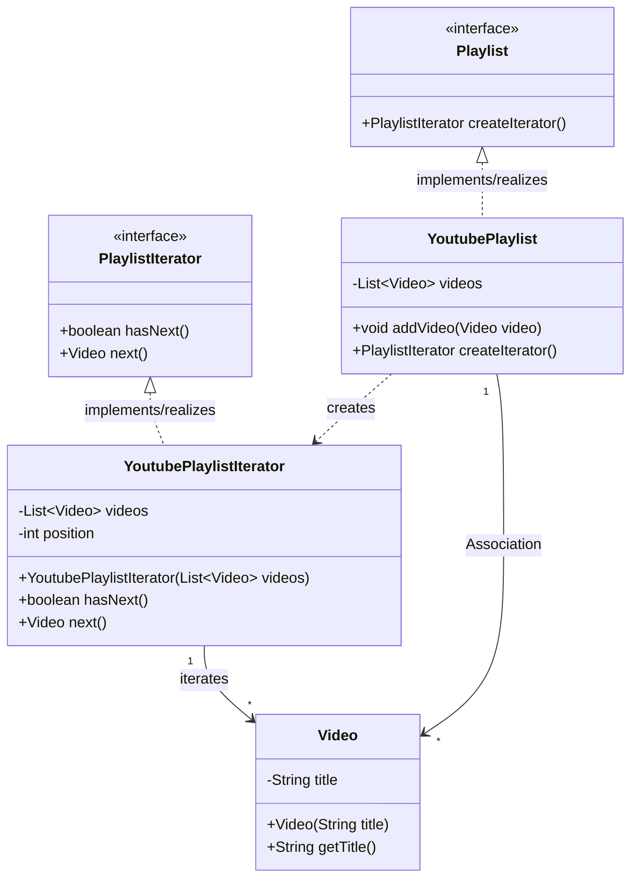

## Behavioural Design Patterns
Behavioral design patterns focus on how objects interact and communicate with each other, helping to define the flow of control in a system. These patterns simplify complex communication logic between objects while promoting loose coupling.

Imagine a TV remote that lets you switch through channels one by one, without needing to know how the channels are stored internally. This kind of controlled access is exactly what behavioral patterns help us achieve.


# Iterator Pattern

Let us consider a scenario where we have a Youtube Playlist containing multiple videos. A client adding to the playlist and getting the videeo titles from the playlist.

```java
class Video {
    private String title;

    public Video(String title) {
        this.title = title;
    }

    public String getTitle() {
        return title;
    }
}

class YoutubePlaylist {
    private List<Video> videos = new ArrayList<>();

    public void addVideo(Video video) {
        videos.add(video);
    }

    public List<Video> getVideos() {
        return videos;
    }
}

public class Main{
    public static void main(String[] args) {
        YoutubePlaylist playlist = new YoutubePlaylist();
        playlist.addVideo(new Video("Video 1"));
        playlist.addVideo(new Video("Video 2"));
        playlist.addVideo(new Video("Video 3"));

        for (Video video : playlist.getVideos()) {
            System.out.println(video.getTitle());
        }
    }
}
```

Now, if we look at the above code, we are can see that the client is saying `YoutubePlaylist` class has a `Video` class and it is iterating over the `Video` class. 

Client shouldn't be knowing about the internal structure of the `YoutubePlaylist` class. We should not expose the internal structure of the `YoutubePlaylist` or `Video` class to the client. They shouldn't know that they can get videos by a for loop.


## Definition

It is a behavioral design pattern that extracts the traversal behaviour of a collection into a separate design pattern. It traverses the elements without exposing  the underlying operation.

It encapsulates all of traversal details. 

Several iterators can go through the same collection at the same time, each with its own state.


## Implementation


```java
class Video {
    private String title;

    public Video(String title) {
        this.title = title;
    }

    public String getTitle() {
        return title;
    }
}

interface PlaylistIterator {
    boolean hasNext();
    Video next();
}

//concrete Iterator - Traversal Algorithm 1
class YoutubePlaylistIterator implements PlaylistIterator {
    private List<Video> videos;
    private int position = 0;

    public YoutubePlaylistIterator(List<Video> videos) {
        this.videos = videos;
    }

    @Override
    public boolean hasNext() {
        return position < videos.size();
    }

    @Override
    public Video next() {
        return hasNext() ? videos.get(position++) : null;
    }
}

class Main{
    
    public static void main(String[] args) {
        YoutubePlaylist playlist = new YoutubePlaylist();
        playlist.addVideo(new Video("Video 1"));
        playlist.addVideo(new Video("Video 2"));
        playlist.addVideo(new Video("Video 3"));


        //Observe that the client is not aware of the internal structure of the YoutubePlaylist class. It simply asks give me the video titles and the iterator takes care of the traversal of the collection.
        PlaylistIterator iterator = new YoutubePlaylistIterator(playlist.getVideos());
        while (iterator.hasNext()) {
            System.out.println(iterator.next().getTitle());
        }
    }
}
```

Now, depending on what kind of traversal we want, we can create different iterators. For example, if we want to traverse the videos in reverse order, we can create a `ReverseYoutubePlaylistIterator` that implements the `PlaylistIterator` interface and traverses the videos in reverse order.

BUT, the client is still getting concerned about the kind of Iterator it is using. It is still aware of the internal structure of the `YoutubePlaylistIterator` class.

This is when you introduce the `Iterable` interface. 


```java
//Iterable interface - can be expanded to support different types of iterators.
interface Playlist{
    PlaylistIterator createIterator();
}

class YoutubePlaylist implements Playlist {
    private List<Video> videos = new ArrayList<>();

    public void addVideo(Video video) {
        videos.add(video);
    }
    
    //No getVideos() method is exposed to the client. The client is not aware of the internal structure of the YoutubePlaylist class. It simply asks give me the video titles and the iterator takes care of the traversal of the collection.

    @Override
    public PlaylistIterator createIterator() {
        return new YoutubePlaylistIterator(videos);
    }
}

class Main{
    
    public static void main(String[] args) {
        YoutubePlaylist playlist = new YoutubePlaylist();
        playlist.addVideo(new Video("Video 1"));
        playlist.addVideo(new Video("Video 2"));
        playlist.addVideo(new Video("Video 3"));


        PlaylistIterator iterator = playlist.createIterator();
        while (iterator.hasNext()) {
            System.out.println(iterator.next().getTitle());
        }
    }
}
```

## When to use ?

- You want to traverse a collection of objects without exposing its underlying representation.

- You need multiple ways to traverse a collection.

- You want an unified way to traverse different types of collections (e.g., lists, trees, graphs) without changing the client code.

- You want to decouple iteration logic from collection logic, allowing for more flexible and maintainable code.

## Where do we use it ?

- In Java, the `Iterator` interface is widely used in the Collections Framework to provide a standard way to traverse collections like `ArrayList`, `HashSet`, and `HashMap`.

## Pros

- **Encapsulation**: The internal structure of the collection is hidden from the client, promoting encapsulation and reducing coupling.

- **Unified Traversal**: Provides a consistent way to traverse different types of collections, making the client code simpler and more flexible.

- **Multiple Iterators**: Allows for multiple iterators to traverse the same collection independently, each maintaining its own state and algorithm.

- **SRP & OCP followed**: The Iterator pattern adheres to the Single Responsibility Principle (SRP) by separating traversal logic from collection logic. It also follows the Open/Closed Principle (OCP) by allowing new traversal algorithms to be added without modifying existing code.


## Cons

- **Increased Code** : Adds extra classes,interfaces, and complexity to the codebase.
- **Overkill for Simple Collections**: For simple collections, the overhead of creating iterators may not be justified, as built-in iteration mechanisms may suffice.

- **External Iteration**: The client is responsible for managing the iteration state, which can lead to errors if not handled properly.

## Class Diagram

