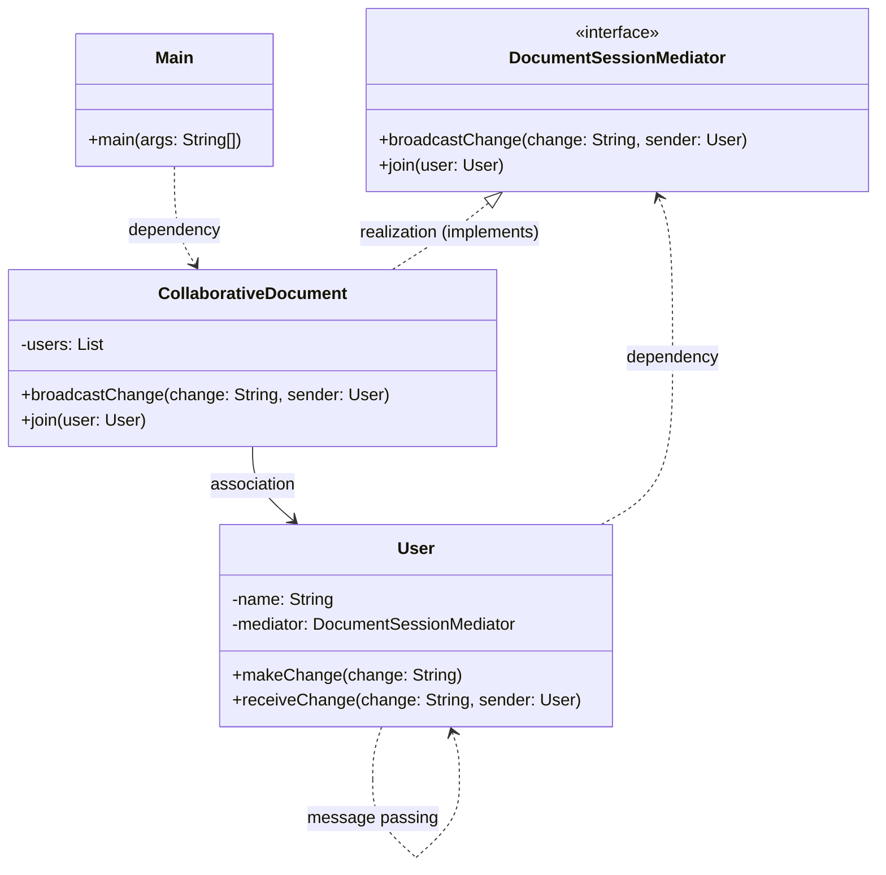

# Mediator Pattern

Let us consider a scenario where in a document editor a user is going to interact with another user. for example, change made by one user should notify the other user

```java
class User{
    private String name;
    private List<User> others;

    public User(String name){
        this.name = name;
        this.others = new ArrayList<>();
    }

    public void addCollaborator(User user){
        others.add(user);
    }

    public void makeChange(String change){
        System.out.println(name + " made a change: " + change);
        for(User u: others){
            u.receiveChange(change,this);
        }
    }

    public void receiveChange(String change, User from){
        System.out.println(name + " received a change from " + from.name + ": " + change);
    }
}
```

Problems with above approach:
- Each user has reference to every other user.
- Adding/removing users breaks the structure
- Hard to orchestrate roles (editor/viewer/admin etc.)
- Difficult to manage permissions,states and notifications,etc.

## Definition

It is a behavioral design pattern that centralizes complex communications between objects into a single Mediator object. 

It promotes loose coupling  and organizes interaction between components.


Real-world example: ATC(Air Traffic Control) system, where the ATC acts as a mediator between multiple aircrafts to avoid collisions and manage air traffic.
## Implementation

```java
// Mediator Interface
interface DocumentSessionMediator {
    void broadcastChange(String change, User sender);
    void join(User user);
}

// Concrete Mediator Class
class CollaborativeDocument implements DocumentSessionMediator {
    private List<User> users = new ArrayList<>();

    @Override
    public void join(User user) {
        users.add(user);
    }

    @Override
    public void broadcastChange(String change, User sender) {
        for (User user : users) {
            if (user != sender) {
                user.receiveChange(change, sender);
            }
        }
    }
}

// User Class
class User {
    protected String name;
    protected DocumentSessionMediator mediator;

    public User(String name, DocumentSessionMediator mediator) {
        this.name = name;
        this.mediator = mediator;
    }

    // Method for users to make a change
    public void makeChange(String change) {
        System.out.println(name + " edited the document: " + change);
        mediator.broadcastChange(change, this);
    }

    // Method to receive a change from another user
    public void receiveChange(String change, User sender) {
        System.out.println(name + " saw change from " + sender.name + ": \"" + change + "\"");
    }
}

// Client Code
class Main {
    public static void main(String[] args) {
        CollaborativeDocument doc = new CollaborativeDocument();

        // Creating users
        User alice = new User("Alice", doc);
        User bob = new User("Bob", doc);
        User charlie = new User("Charlie", doc);

        // Joining the collaborative document
        doc.join(alice);
        doc.join(bob);
        doc.join(charlie);

        // Users making changes
        alice.makeChange("Added project title");
        bob.makeChange("Corrected grammar in paragraph 2");
    }
}
```

## When to use?

- Multiple users or services interact but should remain decoupled.
- You want to manage rules or permissions centrally.
- You want flexible broadcasting,filtering or transformation of messages between components.

## Pros

1. Users do no need to know about other users, they only interact with the mediator.
2. Easy to manage user roles and access centrally.
3. Easier to test and extend.
4. Clean separation of business logic and interaction.


## Cons

1. Mediator can become a complex class overtime if it handles too many responsibilities.
2. SPOF (Single Point of Failure) - if the mediator fails, the whole system can be affected.
3. Adds an extra layer of abstraction which can increase complexity in simple scenarios.


## Class Diagram

