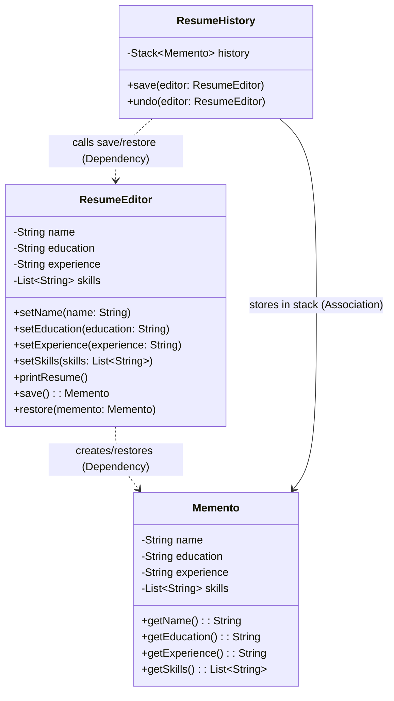

# Memento Pattern

Let us consider a example of a Resume Online Editor. You have a saved resume snapshot, you made some changes to it, and you want to revert back to the previous version. 

```java
class ResumeEditor{
    String name;
    String education;
    String experience;
    List<String> skills;
}
class ResumeSnapshot {
    public String name;
    public String education;
    public String experience;
    public List<String> skills;
    public ResumeSnapshot(ResumeEditor editor) {
        this.name = editor.name;
        this.education = editor.education;
        this.experience = editor.experience;
        this.skills = new ArrayList<>(editor.skills); // Deep copy
    }
    public void restore(ResumeEditor editor) {
        editor.name = this.name;
        editor.education = this.education;
        editor.experience = this.experience;
        editor.skills = new ArrayList<>(this.skills);
    }
}
class Main{
    public static void main(String[] args) {
        ResumeEditor editor = new ResumeEditor();
        editor.name = "John Doe";
        editor.education = "B.Sc. Computer Science";
        editor.experience = "Software Engineer at XYZ Corp";
        editor.skills = Arrays.asList("Java", "Python", "SQL");

        // Create a snapshot of the current state
        ResumeSnapshot snapshot = new ResumeSnapshot(editor);

        // Make changes to the resume
        editor.name = "John Smith";
        editor.education = "M.Sc. Computer Science";
        editor.experience = "Senior Software Engineer at ABC Inc";
        editor.skills = Arrays.asList("Java", "Python", "SQL", "AWS");

        // Restore the previous state from the snapshot
        snapshot.restore(editor);

        // Print the restored resume details
        System.out.println("Restored Resume:");
        System.out.println("Name: " + editor.name);
        System.out.println("Education: " + editor.education);
        System.out.println("Experience: " + editor.experience);
        System.out.println("Skills: " + String.join(", ", editor.skills));
    }
}
```

Here, the `ResumeSnapshot` class is exposing the internal state of the `ResumeEditor` class, which violates encapsulation. At the same time, the `ResumeEditor` class is tightly coupled with the `ResumeSnapshot` class by having a constructor that takes a `ResumeEditor` object and a method that restores the state of the `ResumeEditor` object. 

Only a single snapshot is supported in this approach, and if you want to support multiple snapshots, you would need to create a collection of `ResumeSnapshot` objects. This would further increase the coupling between the two classes and make it harder to maintain the code.

There is no caretaker class to manage the snapshots, the `Main` class is directly creating and restoring the snapshots, which violates the principle of separation of concerns.


This is where we fall back to Memento Pattern.

## Definition


It is a behavioral design pattern that allows an object to capture its internal state and restore it later without violating encapsulation. 

It has three main components:

1. **Originator**: The object whose state needs to be saved and restored. 
2. **Memento**: The object that stores the internal state of the Originator. 
3. **Caretaker**: The object responsible for storing/restoring the mementos. 

Think of it as a Undo/Redo mechanism.

It delegates creating the state snapshots to the actual owner of the state, the Originator. Hence, the original class can make the snapshots since it has full access to its own state. 


## Implementation

```java
// Originator with Memento inside
class ResumeEditor {
    private String name;
    private String education;
    private String experience;
    private List<String> skills;

    public void setName(String name) {
        this.name = name;
    }

    public void setEducation(String education) {
        this.education = education;
    }

    public void setExperience(String experience) {
        this.experience = experience;
    }

    public void setSkills(List<String> skills) {
        this.skills = skills;
    }

    public void printResume() {
        System.out.println("x:----- Resume -----");
        System.out.println("Name: " + name);
        System.out.println("Education: " + education);
        System.out.println("Experience: " + experience);
        System.out.println("Skills: " + skills);
        System.out.println("x:------------------");
    }

    // Save the current state as a Memento
    public Memento save() {
        return new Memento(name, education, experience, List.copyOf(skills));
    }

    // Restore state from Memento
    public void restore(Memento memento) {
        this.name = memento.getName();
        this.education = memento.getEducation();
        this.experience = memento.getExperience();
        this.skills = memento.getSkills();
    }

    // Inner Memento class
    public static class Memento {
        private final String name;
        private final String education;
        private final String experience;
        private final List<String> skills;

        private Memento(String name, String education, String experience, List<String> skills) {
            this.name = name;
            this.education = education;
            this.experience = experience;
            this.skills = skills;
        }

        private String getName() {
            return name;
        }

        private String getEducation() {
            return education;
        }

        private String getExperience() {
            return experience;
        }

        private List<String> getSkills() {
            return skills;
        }
    }
}

// Caretaker
class ResumeHistory {
    private Stack<ResumeEditor.Memento> history = new Stack<>();

    public void save(ResumeEditor editor) {
        history.push(editor.save());
    }

    public void undo(ResumeEditor editor) {
        if (!history.isEmpty()) {
            editor.restore(history.pop());
        }
    }
}
public class Main {
    public static void main(String[] args) {
        ResumeEditor editor = new ResumeEditor();
        ResumeHistory history = new ResumeHistory();

        editor.setName("Alice");
        editor.setEducation("B.Tech CSE");
        editor.setExperience("Fresher");
        editor.setSkills(Arrays.asList("JavaScript", "DSA"));
        history.save(editor);

        editor.setExperience("Intern at Dell Technologies");
        editor.setSkills(Arrays.asList("Java", "DSA", "LLD", "Spring Boot"));
        history.save(editor);

        editor.printResume(); // Shows updated experience
        System.out.println("");
        
        history.undo(editor);
        editor.printResume(); // Shows resume after one undo
        System.out.println("");

        history.undo(editor);
        editor.printResume(); // Shows resume after second undo (initial state)
    }
}
```


## When to use?

- You need to implement undo/redo functionality in your application.
- You want to preserve the encapsulation of the object's state.
- You are handling non-trivial state history management.

## Pros
- **Encapsulation**: The Memento pattern preserves the encapsulation of the Originator's state, as the Memento object is only accessible to the Originator and the Caretaker.

- **Simplified undo/redo** : The Memento pattern provides a straightforward way to implement undo/redo functionality, as the Caretaker can manage a stack of Mementos to revert to previous states.

- **Clear separation of concerns**: The Memento pattern separates the responsibilities of saving and restoring state from the Originator, allowing for cleaner code and easier maintenance.

## Cons

- **Memory Intensive**: Storing multiple Mementos can consume a significant amount of memory, especially if the state of the Originator is large or if there are many Mementos.

- **Caretaker Complexity**: The Caretaker may become complex if it needs to manage a large number of Mementos or if it needs to implement additional functionality, such as limiting the number of stored Mementos or implementing a more sophisticated undo/redo mechanism.

- **Careful Management of Mementos**: The Caretaker must be careful when managing old Mementos, as they may become invalid if the Originator's state changes significantly. This can lead to unexpected behavior if the Caretaker attempts to restore an outdated Memento.


## Class Diagram

