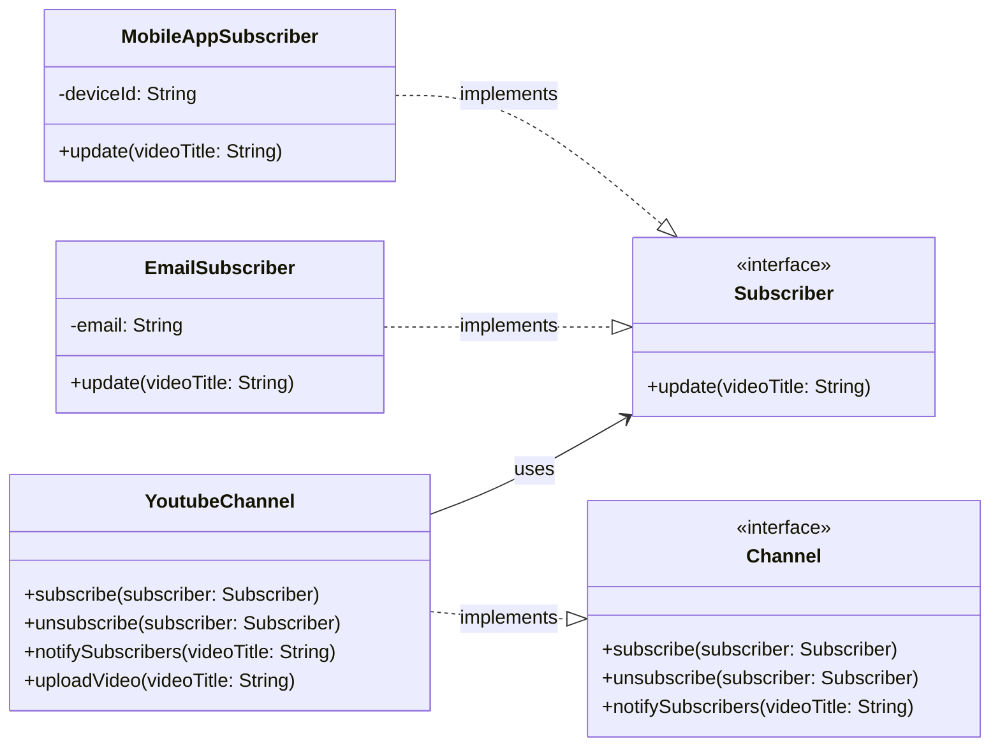

#  Observer Pattern

Let us consider a scenario where a Youtuber has uploaded a new video. The subscribers of the Youtuber will be notified about the new video. 

```java
class YoutubeChannel{
    public void uploadVideo(String videoTitle){
        System.out.println("New video uploaded: " + videoTitle);

        //Manually notifying the subscribers
        System.out.println("Sending email to subscribers about the new video: " + videoTitle);
        System.out.println("Sending push notification to subscribers about the new video: " + videoTitle);
    }
}
```

This above is a bad design because the `YoutubeChannel` class is tightly coupled with the notification mechanism. If we want to change the way notifications are sent (e.g., adding options for end user to turn off email notifications), we will have to modify the `YoutubeChannel` class. This violates the  Single Responsibility Principle.

## Definition

It is a behavioral design pattern that defines one to many dependency between objects so that when one object changes state, all its dependents are notified and updated automatically.

## Solution

```java
//Observer interface
interface Subscriber{
    void update(String videoTitle);
}

//Concrete Observer classes
class EmailSubscriber implements Subscriber{
    private String email;

    public EmailSubscriber(String email){
        this.email = email;
    }

    @Override
    public void update(String videoTitle){
        System.out.println("Sending email to " + email + " about the new video: " + videoTitle);
    }
}

class MobileAppSubscriber implements Subscriber{
    private String deviceId;

    public MobileAppSubscriber(String deviceId){
        this.deviceId = deviceId;
    }

    @Override
    public void update(String videoTitle){
        System.out.println("Sending push notification to device " + deviceId + " about the new video: " + videoTitle);
    }
}

//Subject interface
interface Channel{
    void subscribe(Subscriber subscriber);
    void unsubscribe(Subscriber subscriber);
    void notifySubscribers(String videoTitle);
}

class YoutubeChannel implements Channel{
    private List<Subscriber> subscribers = new ArrayList<>();
    private String channelName;

    public YoutubeChannel(String channelName){
        this.channelName = channelName;
    }

    @Override
    public void subscribe(Subscriber subscriber){
        subscribers.add(subscriber);
    }

    @Override
    public void unsubscribe(Subscriber subscriber){
        subscribers.remove(subscriber);
    }

    @Override
    public void notifySubscribers(String videoTitle){
        for(Subscriber subscriber : subscribers){
            subscriber.update(videoTitle);
        }
    }

    public void uploadVideo(String videoTitle){
        System.out.println("New video uploaded: " + videoTitle);
        notifySubscribers(videoTitle);
    }
}

public class Main {
    public static void main(String[] args) {
        YoutubeChannel channel = new YoutubeChannel("TechWorld");

        Subscriber emailSubscriber = new EmailSubscriber("user@example.com");
        Subscriber mobileAppSubscriber = new MobileAppSubscriber("device123");

        channel.subscribe(emailSubscriber);
        channel.subscribe(mobileAppSubscriber);

        channel.uploadVideo("Java Design Patterns");
    }
}   
```


Now, the `YoutubeChannel` class is not tightly coupled with the notification mechanism. It only knows about the `Subscriber` interface and can notify all subscribers when a new video is uploaded. This design adheres to the Single Responsibility Principle and allows for easy addition of new notification methods without modifying the `YoutubeChannel` class.

## When to use it?

- A change in one object should automatically notify and update other objects.
- You want to decouple the subject from its observers so that they can vary independently.
- Dynamic subscription/unsubscription of observers is needed.

## When to avoid it?

- Too many observers can lead to performance issues. For example, a celebrity goes live  with 10 million subscribers, notifying all of them can be a performance bottleneck. Use a message queue or pub-sub system in such cases.

- Tight control over notification timing is needed. For example, if you want to notify all observers at a specific time, the observer pattern may not be suitable. Use message broker to publish events at a specific time in such cases.


> It works really well with small number of observers, but to scale, we need to move to Event Driven Architecture.

## Pros

- **Loose Coupling**: The subject and observers are loosely coupled. The subject only knows about the observer interface, not the concrete implementations.

- **Extensibility**: New observer types can be added without modifying the subject.

- **Dynamic Relationships**: Observers can be added or removed at runtime, allowing for dynamic relationships between subjects and observers.

- **Reusability**: The observer pattern promotes reusability of code. Observers can be reused across different subjects.

## Cons

- **Unexpected Updates**: If there are multiple notifications for the observer we are not aware of the order of updates. This can lead to unexpected behavior if the observer is not designed to handle multiple updates.

- **Performance Issues**: If there are a large number of observers, notifying all of them can lead to performance issues.

- **Memory Leaks**: If observers are not properly unsubscribed, it can lead to memory leaks. It is important to ensure that observers are unsubscribed when they are no longer needed.

- **Difficulty in Debugging**: The observer pattern can make it difficult to trace the flow of control and debug issues, especially when there are many observers and complex interactions between them.

- **Tight Timing Coupling**: If the subject and observers are tightly coupled in terms of timing, it can lead to issues where the subject is waiting for all observers to complete their updates before proceeding. This can lead to performance bottlenecks and delays in the system.


## Class Diagram

