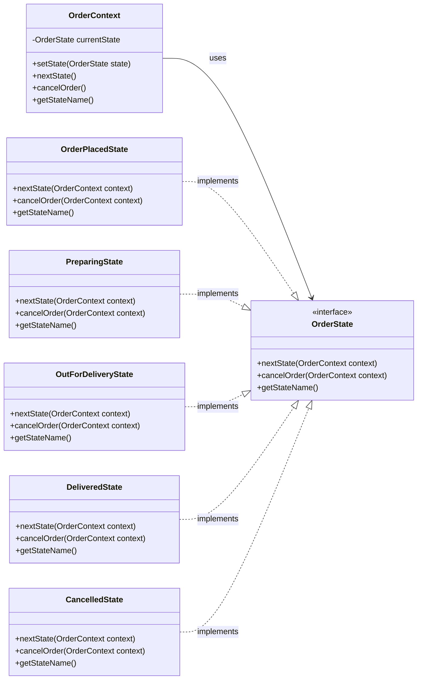

# State Pattern 

Let us consider a scenario of a food delivery application order where the order can be in different states such as "Order Placed", "Preparing", "Out for Delivery", and "Delivered". 

```java
class Order{
    private String state;

    public Order() {
        this.state = "ORDER_PLACED";
    }

    public void cancelOrder() {
        if (state.equals("ORDER_PLACED") || state.equals("PREPARING")) {
            state = "CANCELLED";
            System.out.println("Order has been cancelled.");
        } else {
            System.out.println("Cannot cancel the order now.");
        }
    }

    public void nextState() {
        switch (state) {
            case "ORDER_PLACED":
                state = "PREPARING";
                break;
            case "PREPARING":
                state = "OUT_FOR_DELIVERY";
                break;
            case "OUT_FOR_DELIVERY":
                state = "DELIVERED";
                break;
            default:
                System.out.println("No next state from: " + state);
                return;
        }
        System.out.println("Order moved to: " + state);
    }

    public String getState() {
        return state;
    }
}
class Main{
    public static void main(String[] args) {
        Order order = new Order();
        
        System.out.println("Current State: " + order.getState());

        order.nextState(); // Move to PREPARING
        order.nextState(); // Move to OUT_FOR_DELIVERY
        order.nextState(); // Move to DELIVERED

        order.cancelOrder(); // Should not allow cancellation since it's already delivered

        System.out.println("Final State: " + order.getState());
    }
}
```

Now, the problem with the above implementation is that the state transitions are hardcoded within the `Order` class. At scale we will have certain business logic that will be different for each state. For example, when the order is in the "PREPARING" state, we might want to notify the kitchen staff, while in the "OUT_FOR_DELIVERY" state, we might want to notify the delivery personnel,etc.
This becomes a problem because the `Order` class will become bloated with state-specific logic, making it difficult to maintain and extend.


State Pattern is used to solve this problem.


## Definition

It is a behavioral design pattern that lets an object change its behavior when its internal state changes. 

It helps to encapsulate the state-specific logic to separate classes.

It follows the Open/Closed Principle, allowing the addition of new states without modifying existing code.


## Implementation

```java
class OrderContext {
    private OrderState currentState;

    public OrderContext() {
        this.currentState = new OrderPlacedState(); //default state
    }

    public void setState(OrderState state) {
        this.currentState = state;
    }

    public void nextState() {
        currentState.nextState(this);
    }

    public void cancelOrder() {
        currentState.cancelOrder(this);
    }

    public String getStateName() {
        return currentState.getStateName();
    }
}

interface OrderState {
    void nextState(OrderContext context);
    void cancelOrder(OrderContext context);
    String getStateName();
}


// Concrete states for each stage of the order

// OrderPlacedState handles the behavior when the order is placed
class OrderPlacedState implements OrderState {
    public void next(OrderContext context) {
        context.setState(new PreparingState());
        System.out.println("Order is now being prepared.");
    }

    public void cancel(OrderContext context) {
        context.setState(new CancelledState());
        System.out.println("Order has been cancelled.");
    }

    public String getStateName() {
        return "ORDER_PLACED";
    }
}

// PreparingState handles the behavior when the order is being prepared
class PreparingState implements OrderState {
    public void next(OrderContext context) {
        context.setState(new OutForDeliveryState());
        System.out.println("Order is out for delivery.");
    }

    public void cancel(OrderContext context) {
        context.setState(new CancelledState());
        System.out.println("Order has been cancelled.");
    }

    public String getStateName() {
        return "PREPARING";
    }
}

// OutForDeliveryState handles the behavior when the order is out for delivery
class OutForDeliveryState implements OrderState {
    public void next(OrderContext context) {
        context.setState(new DeliveredState());
        System.out.println("Order has been delivered.");
    }

    public void cancel(OrderContext context) {
        System.out.println("Cannot cancel. Order is out for delivery.");
    }

    public String getStateName() {
        return "OUT_FOR_DELIVERY";
    }
}

// DeliveredState handles the behavior when the order is delivered
class DeliveredState implements OrderState {
    public void next(OrderContext context) {
        System.out.println("Order is already delivered.");
    }

    public void cancel(OrderContext context) {
        System.out.println("Cannot cancel a delivered order.");
    }

    public String getStateName() {
        return "DELIVERED";
    }
}

// CancelledState handles the behavior when the order is cancelled
class CancelledState implements OrderState {
    public void next(OrderContext context) {
        System.out.println("Cancelled order cannot move to next state.");
    }

    public void cancel(OrderContext context) {
        System.out.println("Order is already cancelled.");
    }

    public String getStateName() {
        return "CANCELLED";
    }
}

class Main{
    public static void main(String[] args) {
        OrderContext order = new OrderContext();
        
        System.out.println("Current State: " + order.getStateName());

        order.nextState(); // Move to PREPARING
        order.nextState(); // Move to OUT_FOR_DELIVERY
        order.cancelOrder(); // Should fail since it's out for delivery
        order.nextState(); // Move to DELIVERED

        order.cancelOrder(); // Should not allow cancellation since it's already delivered

        System.out.println("Final State: " + order.getStateName());
    }
}
```

## When to use ?

- Whenever the object's behavior is dependent on its internal state.
- State transitions are well-defined and  finite.
- You want to avoid complex if-else or switch case statements for business logic based on state.
- State transitions should be explicit.
- You want each state to have its own behavior and rules.

## State Vs Strategy Pattern 

Both might look similar but they have different intents.

| Aspect | State Pattern | Strategy Pattern |
|--------|---------------|------------------|
| Intent | Change behavior based on the object's internal state. | Select an algorithm or behavior at runtime based on content. |
| Dependency | States can be dependent as you can easily jump from one state to another. | Strategies are completely independent and unaware of each other. |
| Final Result | It's about doing different things based on the state, hence the results may vary. | Strategies may end up having the same result, depending on the algorithm selected. |
| Usage | Workflow models, lifecycle processes, and state machines. | Algorithm selection, formatting, and dynamic behavior handling. |

## Pros

- Clear separation of state behavior.
- Easy to add new states without modifying existing code.
- Open/Closed Principle adherence.
- Avoids huge if-else or switch-case statements.

## Cons

- Adds more classes
- Slightly more complex initial setup
- Context needs to manage state transitions, which can lead to tight coupling if not designed properly.

- Requires familiarity


## Class Diagram

