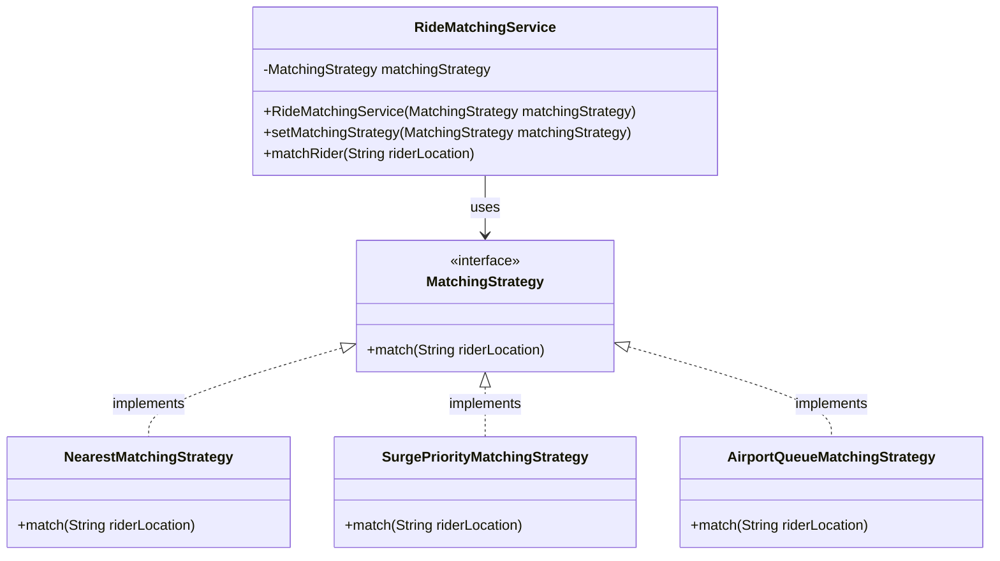

# Strategy Pattern

Let us consider we are writiing Ride Matching Service for Uber.


```java

class RideMatchingService{
    public void matchRider(String riderLocation, String matchingType){
        if(matchingType.equals("NEAREST")){
            //Find nearest driver and match
        }
        else if(matchingType.equals("SURGE_PRIORITY")){
            //Find driver with surge priority and match
        }
        else if(matchingType.equals("AIRPORT_QUEUE")){
            //FIFO based on Airport Queue and match
        }
    }
}
```

The problem with the above design is that the `RideMatchingService` class is tightly coupled with the matching algorithm. If we want to change the matching algorithm, we will have to modify the `RideMatchingService` class. This violates the Open/Closed Principle.
Code becomes messy, difficult to maintain and extend.

## Definition

It is a behavioural design pattern that defines a family of algorithms, puts each of them in separate class and makes their objects interchangeable. It lets the algorithm vary independently from clients that use it.

It is about how we change the behaviour of an object at runtime without changing its class. 

## Implementation

```java

interface MatchingStrategy{
    void match(String riderLocation);
}

class NearestMatchingStrategy implements MatchingStrategy{
    @Override
    public void match(String riderLocation){
        //Find nearest driver and match
    }
}

class SurgePriorityMatchingStrategy implements MatchingStrategy{
    @Override
    public void match(String riderLocation){
        //Find driver with surge priority and match
    }
}

class AirportQueueMatchingStrategy implements MatchingStrategy{
    @Override
    public void match(String riderLocation){
        //FIFO based on Airport Queue and match
    }
}


class RideMatchingService{
    private MatchingStrategy matchingStrategy;

    public RideMatchingService(MatchingStrategy matchingStrategy){
        this.matchingStrategy = matchingStrategy;
    }


    public void setMatchingStrategy(MatchingStrategy matchingStrategy){
        this.matchingStrategy = matchingStrategy;
    }


    public void matchRider(String riderLocation){
        matchingStrategy.match(riderLocation);
    }
}

class Main{
    public static void main(String[] args){
        RideMatchingService rideMatchingService = new RideMatchingService(new NearestMatchingStrategy());
        rideMatchingService.matchRider("Location A");

        //Change the matching strategy at runtime
        rideMatchingService.setMatchingStrategy(new SurgePriorityMatchingStrategy());
        rideMatchingService.matchRider("Location B");
    }
}
```

## When to use?

- You have multi-interchangeable algorithms (HFT financial trading, Ride Matching, etc.)
- You want to follow OCP.
- You want to avoid conditional statements (if-else or switch-case) for selecting algorithms.
- You want to isolate unit testing behaviour-wise. Each strategy can be tested independently.
- You want to select behaviour at runtime. For example, in a ride matching service, you may want to change the matching strategy based on the time of day or traffic conditions.


## Pros

- **Supports Open/Closed Principle**: New strategies can be added without modifying existing code.
- **Easy to add new strategies**: New matching algorithms can be added by implementing the `MatchingStrategy` interface.
- **Runtime behaviour change**: The strategy can be changed at runtime without modifying the client code.
- **Composition over inheritance**: The strategy pattern promotes composition over inheritance, allowing for more flexible and reusable code.

## Cons

- **Increased number of small classes**: Each strategy requires a separate class, which can lead to an increase in the number of classes in the system.

- **Client awareness of strategies**: The client must be aware of the different strategies and how to use them, which can increase complexity.

- **Interface overhead**: Every strategy must implement the same interface, which can lead to overhead if the strategies are very simple and do not require a full interface.

- **Difficulty in understanding**: For developers unfamiliar with the pattern, it may be difficult to understand how the strategies are being used and how they interact with the context class.


## Class Diagram

