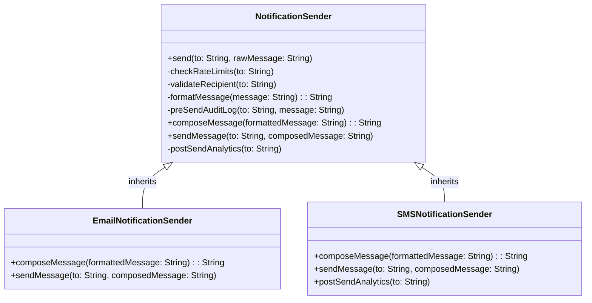

# Template Pattern

Let us consider a scenario of sending notifications based on different channels like Email, SMS.

```java
class EmailNotification{
    public void send(String to, String message){
        System.out.println("Checking rate limits for"+ to);
        System.out.println("Validating email recipient address: "+ to);
        String  formmatted = message.trim();

        //Compose Email
        String composedMessage = "<html><body>"+formmatted+"</body></html>";

        //Send Email
        System.out.println("Sending Email to "+ to + " with content\n: "+ composedMessage);

        //Analytics
        System.out.println("Analytics updated for Email sent to "+ to);
    }
}

class SMSNotification{
    public void send(String to, String message){
        System.out.println("Checking rate limits for"+ to);
        System.out.println("Validating phone number: "+ to);
        String  formmatted = message.trim();

        //Compose SMS
        String composedMessage = "[SMS] " + formmatted;

        //Send SMS
        System.out.println("Sending SMS to "+ to + " with message: "+ composedMessage);

        //Analytics (custom)
        System.out.println("Custom analytics updated for SMS sent to "+ to);
    }
}
```

Now, if we want to add another notification channel like WhatsApp, we need to enforce the workflow of sending notifications like checking rate limits, validating recipient, composing message, sending message, and updating analytics. This is where the Template Pattern comes into play.

## Definition

It is a behavioral design pattern that defines the skeleton of an algorithm in the superclass but lets subclasses override specific steps of the algorithm without changing its structure.


## Implementation

```java
abstract class NotificationSender{

    //Final Template Method
    public final void  send(String to, String rawMessage){
        checkRateLimits(to);
        validateRecipient(to);
        String formattedMessage = formatMessage(rawMessage);
        preSendAuditLog(to, formattedMessage);
        String composedMessage = composeMessage(formattedMessage);
        sendMessage(to, composedMessage);
        postSendAnalytics(to);

    }

    //Common Step 1
    private void checkRateLimits(String to){
        System.out.println("Checking rate limits for"+ to);
    }

    //Common Step 2
    private void validateRecipient(String to){
        System.out.println("Validating recipient: "+ to);
    }

    // Common Step 3
    private String formatMessage(String message){
        return message.trim(); //may contain HTMl, emojis, etc. 
    }

    //Common Step 4
    private void preSendAuditLog(String to, String message){
        System.out.println("Pre-send audit log for "+ to + " with message: "+ message);
    }

    //Hook for subclasses
    protected abstract String composeMessage(String formattedMessage);

    protected abstract void sendMessage(String to, String composedMessage);

    //Common Step 5
    protected void postSendAnalytics(String to){
        System.out.println("Post-send analytics updated for "+ to);
    }

}

class EmailNotificationSender extends NotificationSender{

    @Override
    protected String composeMessage(String formattedMessage){
        return "<html><body>"+formattedMessage+"</body></html>";
    }

    @Override
    protected void sendMessage(String to, String composedMessage){
        System.out.println("Sending Email to "+ to + " with content\n: "+ composedMessage);
    }
}

class SMSNotificationSender extends NotificationSender{

    @Override
    protected String composeMessage(String formattedMessage){
        return "[SMS] " + formattedMessage;
    }

    @Override
    protected void sendMessage(String to, String composedMessage){
        System.out.println("Sending SMS to "+ to + " with message: "+ composedMessage);
    }

    //Ovveriding optional  hook method to customize analytics for SMS
    @Override
    protected void postSendAnalytics(String to){
        System.out.println("Custom analytics updated for SMS sent to "+ to);
    }
}

public Main{
    public static void main(String[] args){
        NotificationSender emailSender = new EmailNotificationSender();
        emailSender.send("john@example.com", "Hello, this is an email message.");

        NotificationSender smsSender = new SMSNotificationSender();
        smsSender.send("john@example.com", "Hello, this is an SMS message.");
    }
}
```

## Key Steps:

1. **Template Method**: Final method in base class that defines the skeleton of the algorithm.
2. **Primitive Operations**: Abstract methods in base class that subclasses must implement to provide specific behavior.
3. **Concrete Operations**: Final or private methods in base class that provide common behavior for all subclasses.
4. **Hooks**: Optional methods in base class with default behavior that subclasses can override to customize behavior.

## When to use?

- You have multiple classes that follow same overall algorithm but differ in specific steps.
- You want to avoid code duplication for specific steps across multiple classes.
- You want to enforce a specific sequence of steps.
- You want to provide optional customizations.
- Don't call us, we will call you. (We will not direclty call EmailNotificationSender or SMSNotificationSender, we will call them through the base class NotificationSender)

## Pros
- **Code Reusability**: Common steps are implemented in the base class, reducing code duplication.
- **Supports OCP**: New notification channels can be added without modifying existing code, adhering to the Open/Closed Principle.
- **Enforces a constant flow**: The template method ensures that the sequence of steps is followed consistently across different notification channels.
- **Optional Customization**: Subclasses can override hooks to provide custom behavior without affecting the overall algorithm.

## Cons

- **Limited Flexibility**: Inheritance based design can limit flexibility, as subclasses are tightly coupled to the base class.
- **Not ideal for varying algorithms**: If the algorithm varies significantly between subclasses, switch to strategy pattern.
- **Too many subclasses**: If there are many variations of the algorithm, it can lead to a proliferation of subclasses, making the codebase harder to maintain.


## Real World Example - Payment Flow, Game engines, frameworks, etc.

## Class Diagram


