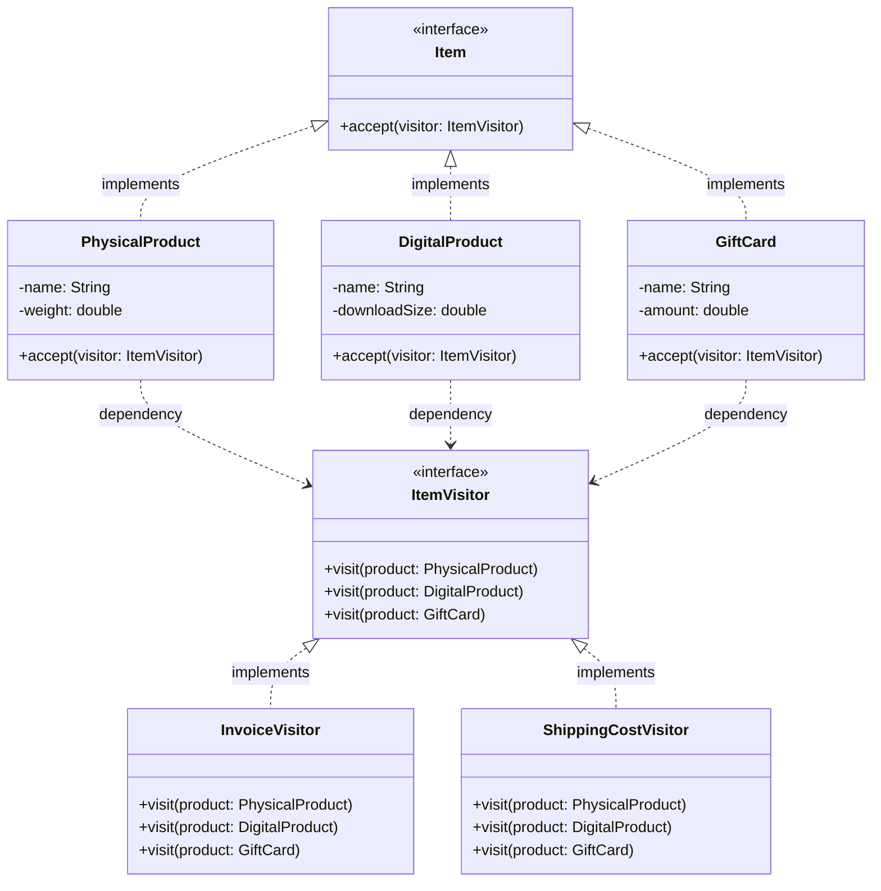

 # Visitor Pattern 

Let us consider a scenario where we have a set of different types of products in an e-commerce application

```java

class PhysicalProduct{
    void printInvoice(){
        System.out.println("Printing invoice for physical product");
    }
    void shipProduct(){
        System.out.println("Shipping physical product");
    }
}
class DigitalProduct{
    void printInvoice(){
        System.out.println("Printing invoice for digital product");
    }
    // Digital products do not require shipping
}
class GiftCard{
    void printInvoice(){
        System.out.println("Printing invoice for gift card");
    }
    double calculateDiscount() {
        System.out.println("Calculating discount for Gift Card...");
        return 5.0; 
    }
    // Gift cards do not require shipping
}
class Main{
    public static void main(String[] args) {
        List<Object> cart = Arrays.asList(new PhysicalProduct(), new DigitalProduct(), new GiftCard());

       for(Object product : cart){
            if(product instanceof PhysicalProduct){
                ((PhysicalProduct) product).printInvoice();
                ((PhysicalProduct) product).shipProduct();
            } else if(product instanceof DigitalProduct){
                ((DigitalProduct) product).printInvoice();
            } else if(product instanceof GiftCard){
                ((GiftCard) product).printInvoice();
                ((GiftCard) product).calculateDiscount();
            }
        }
}
```

Now, in future if we want to add a new functionality to all the products, for example, surge charge or tax calculation, we will have to modify all the classes to add this new functionality. 

This is not a good design as it violates the Single Responsibility Principle since the whole class will become bloated with multiple responsibilities. and that too for every Product type.

Visitor pattern is used to solve this problem. 


## Definition

It is a behavioural design pattern that lets you add new operations to existing class hierarchies without modifying the classes themselves.

It achieves this by moving the logic of the operation to a differnt `Visitor` class. 

The element classes define an `accept` (visitor) method and the visitor class defines a `visit` (element) method for each element type. 


## Implementation

```java
//Element interface
interface Item{
    void accept(ItemVisitor visitor);
}

//Concrete class
class PhysicalProduct implements Item{
    String name;
    double weight;

    public PhysicalProduct(String name, double weight) {
        this.name = name;
        this.weight = weight;
    }

    public void accept(ItemVisitor visitor) {
        visitor.visit(this);
    }
}

class DigitalProduct implements Item{
    String name;
    double downloadSize;

    public DigitalProduct(String name, double downloadSize) {
        this.name = name;
        this.downloadSize = downloadSize;
    }

    public void accept(ItemVisitor visitor) {
        visitor.visit(this);
    }
}

class GiftCard implements Item{
    String name;
    double amount;

    public GiftCard(String name, double amount) {
        this.name = name;
        this.amount = amount;
    }

    public void accept(ItemVisitor visitor) {
        visitor.visit(this);
    }
}

//Visitor interface
interface ItemVisitor{
    void visit(PhysicalProduct product);
    void visit(DigitalProduct product);
    void visit(GiftCard product);
}

class InvoiceVisitor implements ItemVisitor{
    public void visit(PhysicalProduct product) {
        System.out.println("Printing invoice for physical product: " + product.name);
    }

    public void visit(DigitalProduct product) {
        System.out.println("Printing invoice for digital product: " + product.name);
    }

    public void visit(GiftCard product) {
        System.out.println("Printing invoice for gift card: " + product.name);
    }
}

class ShippingCostVisitor implements ItemVisitor{
    public void visit(PhysicalProduct product) {
        System.out.println("Calculating shipping cost for physical product: " + product.name);
    }

    public void visit(DigitalProduct product) {
        System.out.println("No shipping cost for digital product: " + product.name);
    }

    public void visit(GiftCard product) {
        System.out.println("No shipping cost for gift card: " + product.name);
    }
}

//New functionality added without modifying existing classes
class WarehouseVisitor implements ItemVisitor{
    public void visit(PhysicalProduct product) {
        System.out.println("Storing physical product in warehouse: " + product.name);
    }

    public void visit(DigitalProduct product) {
        System.out.println("No warehouse storage needed for digital product: " + product.name);
    }

    public void visit(GiftCard product) {
        System.out.println("No warehouse storage needed for gift card: " + product.name);
    }
}

class Main{
    public static void main(String[] args) {
        List<Item> items = new ArrayList<>();
        items.add(new PhysicalProduct("Laptop", 2.5));
        items.add(new DigitalProduct("E-book", 1.2));
        items.add(new GiftCard("Amazon Gift Card", 50.0));

        ItemVisitor invoiceVisitor = new InvoiceVisitor();
        ItemVisitor shippingCostVisitor = new ShippingCostVisitor();

        for(Item item : items){
            item.accept(invoiceVisitor);
            item.accept(shippingCostVisitor);
        }
    }
}
```

Now, if we want to add a new functionality, for example, warehouse storage, we can simply create a new visitor class `WarehouseVisitor` and implement the `visit` methods for each product type. This way, we can add new operations without modifying the existing classes, adhering to the Open/Closed Principle and also Liskov Substitution Principle is being followed as we are not changing the existing classes but adding new functionality through visitors.

## Key Idea

Visitor Pattern decouples the operations from the objects on which they operate.

Here, the concept of `Double Dispatch` is used. During runtime, it resolves the item type and the ItemVisitor type and calls the appropriate method.

## When to use?

- You have a complex object structure and you want to perform unrelated operations on the elements.
- You want to add operations without modifying the element classes.
- You have to distinct types of elements and each requires different logic for the same operation.
- Avoid if object structure changes frequently, as it will require changes in the visitor interface and all its implementations.


## Pros
- **Open/Closed Principle**: You can add new operations without modifying existing classes.
- **Logic Separation**: The logic for operations is separated from the object structure cleanly.
- **Easy to Add New Operations**: Adding new operations is straightforward by creating new visitor classes.
- **Centralised Operations**: All operations are centralized in visitor classes, making it easier to manage and maintain.


## Cons
- **Adding New Element Types**: If you need to add new element types, you have to modify the visitor interface and all its implementations, which can be cumbersome.

- **Overkill for Simple Structures**: For simple object structures, using the visitor pattern can be overkill and add unnecessary complexity.

- **Double Dispatch Complexity**: The double dispatch might be unintuitive for someone new to the pattern, making it harder to understand and maintain.

- **Tight Coupling**: The elements and visitors are tightly coupled, which can make the system less flexible if the object structure changes frequently.


## Class Diagram



