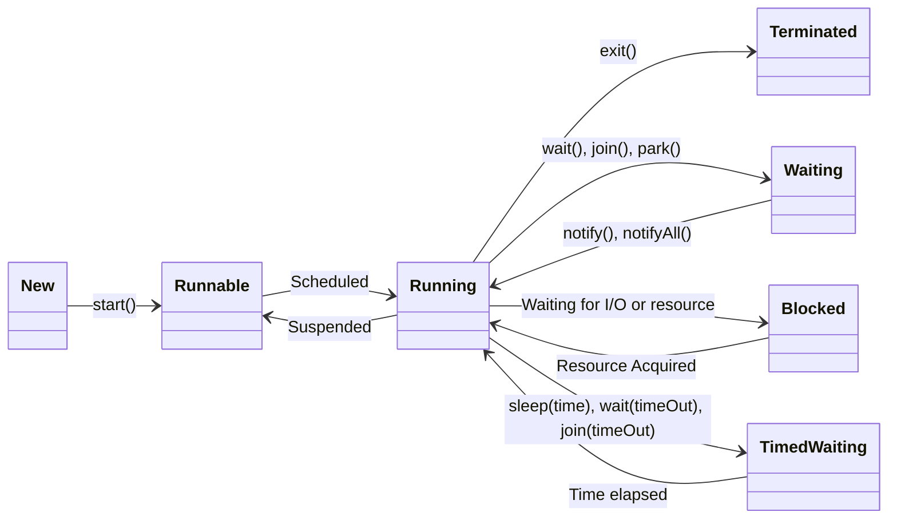

# Creating & Managing Threads

## Problem Statement

Imagine you’ve placed an order, and the next steps involve sending three notifications:

- Send an SMS: This takes 2 seconds.
- Send an Email: This takes 3 seconds.
- Send ETA (Estimated Time of Arrival): This takes 5 seconds.


Let us look at the java code performing these tasks without Multithreading:

```java
class OrderService{
    public static void main(String[] args) {
        System.out.println("Placing order...");
        sendSMS();
        System.out.println("Task 1 completed");
        sendEmail();
        System.out.println("Task 2 completed");
        String eta = calculateETA();
        System.out.println("Order Placed. ETA: " + eta);
        System.out.println("Task 3 completed");
    }
    private static void sendSMS() {
        try {
            Thread.sleep(2000);
            System.out.println("SMS sent");
        } catch (InterruptedException e) {
            e.printStackTrace();
        }
    }
    private static void sendEmail() {
        try {
            Thread.sleep(3000);
            System.out.println("Email sent");
        } catch (InterruptedException e) {
            e.printStackTrace();
        }
    }
    private static String calculateETA() {
        try {
            Thread.sleep(5000);
            return "5 minutes";
        } catch (InterruptedException e) {
            e.printStackTrace();
            return "Error calculating ETA";
        }
    }
}
class Main {
 
    public static void main(String[] args) {
        try {
            OrderService.main(args); 
        } catch (InterruptedException e) {
            e.printStackTrace();
        }
    }
}
```

The above code will take 10 seconds to complete all the tasks. This is because each task is executed sequentially, and the next task starts only after the previous one has completed.

This is where **Multithreading** comes into play. By using threads and multiple cores of a CPU, we can execute these tasks concurrently, which will significantly reduce the total execution time.


## Implementing Multithreading using Thread class

```java
class SMSThread extends Thread {
    public void run() {
        try {
            Thread.sleep(2000);
            System.out.println("SMS sent");
        } catch (InterruptedException e) {
            e.printStackTrace();
        }
    }
}

class EmailThread extends Thread {
    public void run() {
        try {
            Thread.sleep(3000);
            System.out.println("Email sent");
        } catch (InterruptedException e) {
            e.printStackTrace();
        }
    }
}

public class Main{
    public static void main(String[] args) {
        SMSThread smsThread = new SMSThread();
        EmailThread emailThread = new EmailThread();
        System.out.println("Tasks started...");
        smsThread.start(); //start() method is used to start the thread and call the run() method
        System.out.println("Task 1 ongoing");
        emailThread.start();
        System.out.println("Task 2 ongoing");

        try {
            smsThread.join(); //join() waits for the SMS thread to complete (die)
            emailThread.join();
            System.out.println("All tasks completed");
        } catch (InterruptedException e) {
            e.printStackTrace();
        }
    }
}
```


## Implementing Multithreading using Runnable interface

- **Runnable Interface** : The `Thread` class in java implements the `Runnable` interface. The `Runnable` is implemented by any class whose instances are intended to be executed by a thread. The class must define a method of no arguments called `run`.

When an object implementing interface `Runnable` is used to create a thread, starting the thread causes the object's `run` method to be called in that separately executing thread.

```java
class SMSThreadRunnable implements Runnable{
    @Override
    public void run() {
        try {
            Thread.sleep(2000);
            System.out.println("SMS sent using Runnable Thread");
        } catch (InterruptedException e) {
            e.printStackTrace();
        }
    }
}
class EmailThreadRunnable implements Runnable{
    @Override
    public void run() {
        try {
            Thread.sleep(3000);
            System.out.println("Email sent using Runnable Thread");
        } catch (InterruptedException e) {
            e.printStackTrace();
        }
    }
}

class Main{
    public static void main(String[] args) {
        Thread smsThread = new Thread(new SMSThreadRunnable());
        Thread emailThread = new Thread(new EmailThreadRunnable());
        System.out.println("Tasks started...");
        smsThread.start();
        System.out.println("Task 1 ongoing");
        emailThread.start();
        System.out.println("Task 2 ongoing");

        try {
            smsThread.join();
            emailThread.join();
            System.out.println("All tasks completed");
        } catch (InterruptedException e) {
            e.printStackTrace();
        }
    }
}
```

## Fire and Forget

Both `Runnable` and `Thread` implementations follow the "Fire and Forget" approach.

In this pattern, tasks are initiated (fired), but the system doesn't wait for a result or confirmation of their completion. Instead, the tasks are executed independently in the background, and the caller doesn't need to know when or how they finish.

This approach is useful for tasks that don't require immediate feedback or results, allowing the main program to continue executing without being blocked by the completion of these tasks.

But when we need the result of a task, like `calculateETA()`, this has limitations. 

This is where **Future** and **Callable** come into play for result-oriented tasks.


## Callable & Future

Callable is a functional interface  like Runnable introduced in Java 5 as part of the java.util.concurrent package. 

Unlike Runnable, it allows tasks to **return a result** and **throw checked exceptions.**

```java
class ETACalculator implements Callable<String> {
    public final String location;

    public ETACalculator(String location) {
        this.location = location;
    }
    @Override
    public String call() throws Exception {
       System.out.println("[" + Thread.currentThread().getName() + "] Calculating ETA for " + location);
       Thread.sleep(3000);
       return "ETA for " + location + " is 5 minutes";
    }
}
public Main{
    public static void main(String[] args) {
        //we cannot do:
        //Thread thread = new Thread(new ETACalculator("New York")); // This will not work because Thread implements Runnable, not Callable

        //We can use FutureTask to wrap the Callable and then pass it to a Thread because FutureTask extends RunnableFuture, which also extends Runnable.
        FutureTask etaTaskRunnable = new FutureTask<>(new ETACalculator("New York"));
        Thread etaThread = new Thread(etaTaskRunnable);

        etaThread.start();

        try {
            String eta = etaTaskRunnable.get(); //get() method waits for the result of the Callable task from the call() method and returns it. It blocks the current thread until the result is available.
            System.out.println(eta);
        } catch (InterruptedException | ExecutionException e) {
            e.printStackTrace();
        }
    }
}
```


## Other ways of executing tasks inside a Thread Class

### Directly defined Runnable 

```java
Runnable r = new Runnable() {
    @Override
    public void run() {
        System.out.println("Task executed in a thread");
    }
};

Thread thread = new Thread(r);
thread.start();

//Java 8 and above, we can use lambda expressions to simplify the Runnable definition:

Runnable rLambda = () -> System.out.println("Task executed in a thread using lambda");
Thread threadLambda = new Thread(rLambda);
threadLambda.start();

//can also directly pass the lambda expression to the Thread constructor:
Thread threadDirect = new Thread(() -> System.out.println("Task executed in a thread using lambda directly"));
threadDirect.start();

```

## Thread Lifecycle

